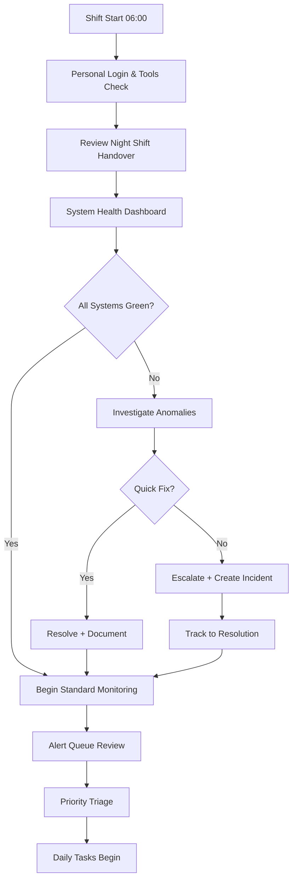
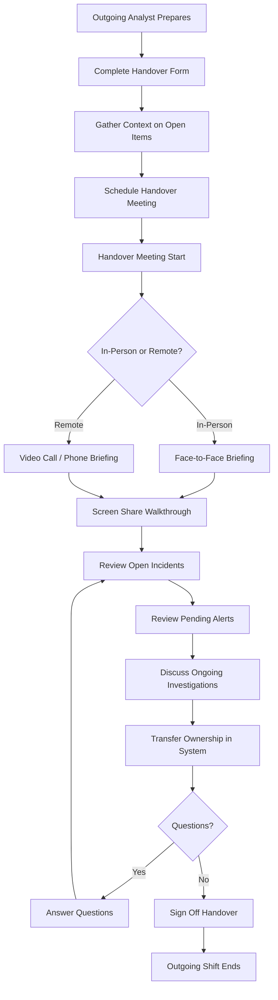

# Daily Operations Runbook

**Document ID:** SOC-RB-007  
**Version**: 1.5  
**Classification**: Internal Use Only  
**Last Updated:** January 2025  
**Owner:** Djezzy National SOC Operations Team

---

## Table of Contents

1. [Overview](#overview)
2. [Morning Health Check Procedures](#morning-health-check-procedures)
3. [Shift Handover Checklist](#shift-handover-checklist)
4. [Log Review Priorities](#log-review-priorities)
5. [Capacity Monitoring Tasks](#capacity-monitoring-tasks)
6. [Report Generation Schedule](#report-generation-schedule)

---

## Overview

This runbook defines the standard daily operational procedures for the Djezzy National SOC Platform, ensuring consistent operations across all shifts.

### Purpose

- Establish consistent daily routines for SOC analysts
- Ensure comprehensive system health monitoring
- Maintain smooth shift transitions
- Enable proactive issue identification
- Support compliance and reporting requirements

### Shift Structure

| Shift | Hours (Local) | Staffing | Primary Focus |
|-------|--------------|----------|---------------|
| **Morning** | 06:00 - 14:00 | Full team | Active monitoring, investigations |
| **Afternoon** | 14:00 - 22:00 | Full team | Continued ops, project work |
| **Night** | 22:00 - 06:00 | Reduced | Alert response, maintenance windows |

### Key Performance Indicators (Daily)

| Metric | Target | Measurement |
|--------|--------|-------------|
| Health check completion | 100% by 07:00 | Checklist sign-off |
| Alert queue clearance | < 50 alerts by EOD | Dashboard metric |
| SLA compliance | > 95% | Automated tracking |
| Documentation quality | All cases updated | Audit review |
| Handover completeness | 100% fields completed | Checklist |

---

## Morning Health Check Procedures

### System Health Dashboard Review

Every morning shift begins with a comprehensive system health review:



### Health Check Command Reference

```bash
#!/bin/bash
# morning_health_check.sh
# Automated morning health check script

set -e

TIMESTAMP=$(date +%Y%m%d_%H%M%S)
LOG_FILE="/var/log/soc/health_checks/morning_$TIMESTAMP.log"
ALERT_THRESHOLD=80  # Percentage before alert

exec > >(tee "$LOG_FILE") 2>&1

echo "==========================================="
echo "MORNING HEALTH CHECK"
echo "Timestamp: $(date -u)"
echo "Executed by: $(whoami)"
echo "==========================================="

PASS_COUNT=0
FAIL_COUNT=0
WARN_COUNT=0

check_pass() {
    echo "✅ PASS: $1"
    ((PASS_COUNT++))
}

check_fail() {
    echo "❌ FAIL: $1"
    ((FAIL_COUNT++))
}

check_warn() {
    echo "⚠️ WARN: $1"
    ((WARN_COUNT++))
}

# ============================================
# 1. PLATFORM APPLICATION HEALTH
# ============================================
echo ""
echo "--- 1. Platform Application ---"

# Main application health endpoint
HTTP_CODE=$(curl -sf -o /dev/null -w "%{http_code}" --max-time 10 https://soc.djezzy.dz/api/health || echo "000")
if [ "$HTTP_CODE" = "200" ]; then
    check_pass "SOC API Health Endpoint (HTTP $HTTP_CODE)"
else
    check_fail "SOC API Health Endpoint (HTTP $HTTP_CODE)"
fi

# Application response time
RESPONSE_TIME=$(curl -sf -o /dev/null -w "%{time_total}" --max-time 10 https://soc.djezzy.dz/api/health || echo "999")
if (( $(echo "$RESPONSE_TIME < 2.0" | bc -l) )); then
    check_pass "API Response Time (${RESPONSE_TIME}s)"
else
    check_warn "API Response Time Slow (${RESPONSE_TIME}s)"
fi

# User authentication test
AUTH_TEST=$(curl -sf -X POST https://soc.djezzy.dz/api/auth/login \
  -H "Content-Type: application/json" \
  -d '{"username":"health_check","password":"test"}' \
  --max-time 10 | head -c 100 || echo "ERROR")
if echo "$AUTH_TEST" | grep -q "token\|invalid\|unauthorized"; then
    check_pass "Authentication Service Responsive"
else
    check_fail "Authentication Service Error"
fi

# ============================================
# 2. DATABASE HEALTH
# ============================================
echo ""
echo "--- 2. PostgreSQL Database ---"

# Database connectivity
if PGPASSWORD="$DB_PASS" psql -h "$DB_HOST" -U "$DB_USER" -d "$DB_NAME" -c "SELECT 1;" &>/dev/null; then
    check_pass "PostgreSQL Connectivity"
else
    check_fail "PostgreSQL Connection Failed"
fi

# Database replication status (if applicable)
REPL_STATUS=$(PGPASSWORD="$DB_PASS" psql -h "$DB_HOST" -U "$DB_USER" -d "$DB_NAME" -t -c "
SELECT CASE WHEN pg_is_in_recovery() THEN 'REPLICA' ELSE 'PRIMARY' END;
" 2>/dev/null | tr -d ' ')
check_pass "Database Role: $REPL_STATUS"

# Replication lag (for replicas)
if [ "$REPL_STATUS" = "REPLICA" ]; then
    REPL_LAG=$(PGPASSWORD="$DB_PASS" psql -h "$DB_HOST" -U "$DB_USER" -d "$DB_NAME" -t -c "
    SELECT EXTRACT(EPOCH FROM (now() - pg_last_xact_replay_timestamp()));
    " 2>/dev/null | tr -d ' ')
    if (( $(echo "$REPL_LAG < 300" | bc -l) )); then
        check_pass "Replication Lag: ${REPLAG}s"
    else
        check_warn "Replication Lag High: ${REPL_LAG}s"
    fi
fi

# Database connection count
CONN_COUNT=$(PGPASSWORD="$DB_PASS" psql -h "$DB_HOST" -U "$DB_USER" -d "$DB_NAME" -t -c "
SELECT count(*) FROM pg_stat_activity;
" 2>/dev/null | tr -d ' ')
MAX_CONN=$(PGPASSWORD="$DB_PASS" psql -h "$DB_HOST" -U "$DB_USER" -d "$DB_NAME" -t -c "
SHOW max_connections;
" 2>/dev/null | tr -d ' ')
CONN_PCT=$(( CONN_COUNT * 100 / MAX_CONN ))
if [ $CONN_PCT -lt $ALERT_THRESHOLD ]; then
    check_pass "DB Connections: $CONN_COUNT/$MAX_CONN ($CONN_PCT%)"
else
    check_warn "DB Connections High: $CONN_COUNT/$MAX_CONN ($CONN_PCT%)"
fi

# Database size monitoring
DB_SIZE=$(PGPASSWORD="$DB_PASS" psql -h "$DB_HOST" -U "$DB_USER" -d "$DB_NAME" -t -c "
SELECT pg_size_pretty(pg_database_size('$DB_NAME'));
" 2>/dev/null | tr -d ' ')
check_pass "Database Size: $DB_SIZE"

# ============================================
# 3. REDIS CACHE HEALTH
# ============================================
echo ""
echo "--- 3. Redis Cache ---"

# Redis connectivity
REDIS_RESPONSE=$(redis-cli -h "$REDIS_HOST" -a "$REDIS_PASS" PING 2>/dev/null)
if [ "$REDIS_RESPONSE" = "PONG" ]; then
    check_pass "Redis Connectivity"
else
    check_fail "Redis Connection Failed ($REDIS_RESPONSE)"
fi

# Redis memory usage
REDIS_MEMORY=$(redis-cli -h "$REDIS_HOST" -a "$REDIS_PASS" INFO memory 2>/dev/null | grep used_memory_human | cut -d: -f2 | tr -d '\r')
REDIS_MAX_MEMORY=$(redis-cli -h "$REDIS_HOST" -a "$REDIS_PASS" INFO memory 2>/dev/null | grep maxmemory_human | cut -d: -f2 | tr -d '\r')
check_pass "Redis Memory: $REDIS_MEMORY / $REDIS_MAX_MEMORY"

# Redis key count
KEY_COUNT=$(redis-cli -h "$REDIS_HOST" -a "$REDIS_PASS" DBSIZE 2>/dev/null)
check_pass "Redis Keys: $KEY_COUNT"

# ============================================
# 4. KAFKA MESSAGE QUEUE
# ============================================
echo ""
echo "--- 4. Kafka Message Queue ---"

# Kafka broker availability
KAFKA_BROKERS=$(kafka-broker-api-versions.sh --bootstrap-server "$KAFKA_BROKER" 2>&1 | head -1)
if echo "$KAFKA_BROKERS" | grep -q "version"; then
    check_pass "Kafka Broker Available"
else
    check_fail "Kafka Broker Unavailable"
fi

# Consumer group lag (critical topics)
for TOPIC in soc-alerts soc-events soc-metrics; do
    LAG=$(kafka-consumer-groups.sh --bootstrap-server "$KAFKA_BROKER" \
      --describe --group "${TOPIC}-consumer" 2>/dev/null | tail -1 | awk '{print $6}')
    if [ -n "$LAG" ] && [ "$LAG" -lt 1000 ]; then
        check_pass "Topic $TOPIC Lag: $LAG"
    elif [ -n "$LAG" ]; then
        check_warn "Topic $TOPIC Lag High: $LAG"
    fi
done

# ============================================
# 5. KUBERNETES CLUSTER
# ============================================
echo ""
echo "--- 5. Kubernetes Cluster ---"

# Node status
READY_NODES=$(kubectl get nodes --no-headers 2>/dev/null | grep -c "Ready" || echo "0")
TOTAL_NODES=$(kubectl get nodes --no-headers 2>/dev/null | wc -l)
if [ "$READY_NODES" = "$TOTAL_NODES" ]; then
    check_pass "K8s Nodes: $READY_NODES/$TOTAL_NODES Ready"
else
    check_warn "K8s Nodes: $READY_NODES/$TOTAL_NODES Ready"
fi

# Pod status (soc namespace)
RUNNING_PODS=$(kubectl get pods -n soc-production --no-headers 2>/dev/null | grep -c "Running" || echo "0")
TOTAL_PODS=$(kubectl get pods -n soc-production --no-headers 2>/dev/null | wc -l)
if [ "$RUNNING_PODS" = "$TOTAL_PODS" ]; then
    check_pass "SOC Pods: $RUNNING_PODS/$TOTAL_PODS Running"
else
    check_warn "SOC Pods: $RUNNING_PODS/$TOTAL_PODS Running"
fi

# Check for crash looping pods
CRASH_LOOPS=$(kubectl get pods -n soc-production -o json 2>/dev/null | \
  jq '[.items[] | select(.status.containerStatuses[].restartCount > 3)] | length')
if [ "$CRASH_LOOPS" = "0" ]; then
    check_pass "No Crash Looping Pods"
else
    check_fail "$CRASH_LOOPS Pod(s) Crash Looping"
fi

# ============================================
# 6. SECURITY INTEGRATIONS
# ============================================
echo ""
echo "--- 6. Security Tool Integrations ---"

# Wazuh SIEM
WAZUH_STATUS=$(curl -sf -u "$WAZUH_USER:$WAZUH_PASS" --max-time 10 \
  "https://wazuh-soc.djezzy.dz:5500/" 2>/dev/null | head -c 200)
if echo "$WAZUH_STATUS" | grep -q "error.*0\|Wazuh"; then
    check_pass "Wazuh SIEM API"
else
    check_warn "Wazuh SIEM Unreachable"
fi

# TheHive
THEHIVE_STATUS=$(curl -sf -H "Authorization: Bearer $THEHIVE_KEY" --max-time 10 \
  "https://thehive-soc.djezzy.dz:9000/api/status" 2>/dev/null | head -c 100)
if echo "$THEHIVE_STATUS" | grep -q "ok\|status"; then
    check_pass "TheHive Case Management"
else
    check_warn "TheHive Unreachable"
fi

# MISP
MISP_STATUS=$(curl -sf -H "Authorization: $MISP_KEY" --max-time 10 \
  "https://misp-soc.djezzy.dz/servers/health" 2>/dev/null | head -c 100)
if echo "$MISP_STATUS" | grep -q "health\|version"; then
    check_pass "MISP Threat Intel"
else
    check_warn "MISP Unreachable"
fi

# OpenCTI
OCTI_STATUS=$(curl -sf --max-time 10 \
  "https://opencti-soc.djezzy.dz:8080/health" 2>/dev/null | head -c 100)
if echo "$OCTI_STATUS" | grep -q "health\|status"; then
    check_pass "OpenCTI Threat Platform"
else
    check_warn "OpenCTI Unreachable"
fi

# ============================================
# 7. MONITORING SYSTEMS
# ============================================
echo ""
echo "--- 7. Monitoring Systems ---"

# Prometheus
PROM_STATUS=$(curl -sf --max-time 5 "http://prometheus-soc.djezzy.dz:9090/-/healthy" 2>/dev/null)
if [ "$PROM_STATUS" = "Prometheus is Healthy." ]; then
    check_pass "Prometheus"
else
    check_fail "Prometheus Unhealthy"
fi

# Grafana
GRAFANA_STATUS=$(curl -sf -o /dev/null -w "%{http_code}" --max-time 5 \
  "https://grafana-soc.djezzy.dz/api/health" 2>/dev/null)
if [ "$GRAFANA_STATUS" = "200" ]; then
    check_pass "Grafana Dashboards"
else
    check_warn "Grafana Issue (HTTP $GRAFANA_STATUS)"
fi

# ============================================
# SUMMARY
# ============================================
echo ""
echo "==========================================="
echo "HEALTH CHECK SUMMARY"
echo "==========================================="
echo "Passed:   $PASS_COUNT"
echo "Warnings: $WARN_COUNT"
echo "Failed:   $FAIL_COUNT"
echo "Total:    $((PASS_COUNT + WARN_COUNT + FAIL_COUNT))"
echo "Completed: $(date -u)"
echo "==========================================="

# Send summary notification if failures
if [ $FAIL_COUNT -gt 0 ]; then
    ./notify_health.sh "WARNING" "$FAIL_COUNT failures" "$LOG_FILE"
    exit 1
elif [ $WARN_COUNT -gt 0 ]; then
    ./notify_health.sh "INFO" "$WARN_COUNT warnings" "$LOG_FILE"
    exit 0
else
    ./notify_health.sh "OK" "All systems normal" "$LOG_FILE"
    exit 0
fi
```

### Quick Health Check (Web Interface)

For rapid visual verification, use the main dashboard:

```markdown
## DASHBOARD QUICK CHECK LIST

### Main Dashboard (https://soc.djezzy.dz)

**System Status Cards (Top Row):**
- [ ] Overall Status: GREEN
- [ ] Alerts Processing: ACTIVE (no backlog indicator)
- [ ] Incidents: Count reasonable (< 20 active)
- [ ] Integrations: All showing connected

**Alert Feed (Center Panel):**
- [ ] Recent alerts appearing (within last 5 minutes)
- [ ] No sustained P1/P2 without acknowledgment
- [ ] Timestamps are current (not stale)

**Integration Status (Side Panel):**
- [ ] Wazuh: Connected, events flowing
- [ ] TheHive: Connected
- [ ] MISP: Connected
- [ ] GRR: Agents reporting
- [ ] Suricata: Sensors active

**Performance Metrics (Bottom Row):**
- [ ] API Response Time: < 500ms (p95)
- [ ] Event Ingestion Rate: Within baseline ±20%
- [ ] Queue Depth: < 1000 messages
```

---

## Shift Handover Checklist

### Handover Process Flow



### Handover Form Template

```markdown
# SHIFT HANDOVER REPORT

**Date:** [DATE]  
**Outgoing Shift:** [MORNING/AFTERNOON/NIGHT]  
**Incoming Shift:** [NEXT SHIFT]  
**Handover Time:** [START TIME] - [END TIME]

---

## 1. SHIFT STATISTICS

| Metric | This Shift | Yesterday Same Shift | Variance |
|--------|-----------|---------------------|----------|
| Total Alerts Received | | | |
| Alerts Triaged | | | |
| True Positives | | | |
| False Positives | | | |
| Incidents Created | | | |
| Incidents Closed | | | |
| Escalations | | | |

## 2. OPEN INCIDENTS REQUIRING ATTENTION

### INC-[ID]: [Brief Title]
- **Severity:** [P1/P2/P3/P4]
- **Status:** [Current Phase]
- **Summary:** [What's happening]
- **Next Action:** [What incoming analyst should do]
- **Context:** [Any important background]
- **Deadline:** [If SLA pressure]

*(Repeat for each open incident)*

## 3. ALERTS IN PROGRESS

| Alert ID | Source | Initial Assessment | Status | Owner Notes |
|----------|--------|-------------------|-------|-------------|
| | | | | |
| | | | | |

## 4. ONGOING INVESTIGATIONS

**Investigation:** [Title/Brief Description]
- **Started:** [When]
- **Lead Analyst:** [Who was working it]
- **Current Status:** [Where we are]
- **Next Steps:** [What needs to happen]
- **Relevant Artifacts:** [Links to evidence/cases]
- **Blocking Issues:** [Anything preventing progress]

## 5. SYSTEM ISSUES / ANOMALIES NOTICED

| System/Component | Issue Observed | Impact | Workaround | Status |
|------------------|----------------|--------|------------|--------|
| | | | | |

## 6. PENDING TASKS / FOLLOW-UPS

| Task | Due Date | Owner | Priority | Notes |
|------|---------|-------|----------|-------|
| | | | | |

## 7. COMMUNICATIONS / STAKEHOLDER UPDATES

- **Management Updates Sent:** [List any notifications sent]
- **Pending Communications:** [Anything that needs to go out]
- **External Parties Contacted:** [Vendors, partners, etc.]

## 8. KNOWLEDGE TRANSFER

**Tips/Notes for Incoming Shift:**
-
-

**Things That Didn't Work Well This Shift:**
-
-

**Things That Worked Well:**
-
-

## 9. TOOLS AND ACCESS

- **Tool Issues Encountered:** [Any access problems, bugs found]
- **Credentials Requiring Rotation:** [If any]
- **Systems Under Maintenance:** [Anything scheduled or in progress]

## 10. HANDOVER SIGN-OFF

**Outgoing Analyst:** _________________ **Time:** _______
**Incoming Analyst:** _________________ **Time:** _______

**Acknowledged:**
- [ ] All open incidents reviewed
- [ ] All pending alerts understood
- [ ] System issues noted
- [ ] Questions asked and answered
- [ ] Ownership transferred in ticketing system

---
*Save this handover to: /opt/soc/handovers/[DATE]_[SHIFT].md*
```

### Critical Information Handover

For high-priority situations requiring detailed context:

```markdown
## CRITICAL HANDOVER SUPPLEMENT

Use this section when handing over active P1 incidents or complex situations.

### Situation Overview (Executive Summary)
[2-3 sentences explaining what's happening at a high level]

### Timeline of Key Events
| Time (UTC) | Event | Impact |
|------------|-------|--------|
| | | |

### Current State
- **Active Threat Contained:** YES / NO
- **Business Impact:** [Description]
- **Customer Impact:** [Description if any]
- **Regulatory Implications:** [YES/NO - details]

### Who's Involved (Contacted)
| Role | Name | Contact | Last Communication |
|------|------|--------|-------------------|
| Incident Commander | | | |
| Technical Lead | | | |
| Management | | | |
| External Party | | | |

### Immediate Actions Required (Next 2 Hours)
1. 
2. 
3.

### Decisions Made (and Rationale)
- Decision: ______________________
- Rationale: ____________________
- Made By: _____________________
- When: ________________________

### Decisions Pending
- Decision needed: ________________
- Options being considered: ________
- Blocking factor: ________________
```

---

## Log Review Priorities

### Daily Log Review Schedule

| Time | Activity | Duration | Focus Area |
|------|----------|----------|------------|
| 07:00 | Security event overnight review | 30 min | High-severity events, anomalies |
| 10:00 | Authentication log review | 15 min | Failed logins, unusual access |
| 13:00 | Integration health logs | 15 min | Tool connectivity issues |
| 16:00 | Performance log review | 15 min | Slow queries, timeouts |
| 19:00 | End-of-day summary | 15 min | Trends, patterns |

### Priority Log Sources

#### 1. Wazuh SIEM Alerts (Highest Priority)

```bash
# Query for high-severity alerts from last 24 hours
curl -sk -u "$WAZUH_USER:$WAZUH_PASS" \
  "https://wazuh-soc.djezzy.dz:5500/alerts?sort=-timestamp&limit=100" \
  | jq '.data.alerts[] | select(.rule.level >= 10) | {
      timestamp: .timestamp,
      rule_id: .rule.id,
      rule_level: .rule.level,
      description: .rule.description,
      agent: .agent.name,
      full_log: .full_log
    }'
```

**What to look for:**
- Level 12+ alerts (indicating potential compromise)
- Multiple alerts from same source in short time window
- Alerts from critical systems (database servers, domain controllers)
- New alert rules firing unexpectedly

#### 2. Authentication Logs

```sql
-- PostgreSQL query for authentication analysis
-- Run against application audit database

-- Failed authentication attempts (last 24 hours)
SELECT 
    username,
    client_ip,
    COUNT(*) as failed_attempts,
    MIN(attempt_time) as first_attempt,
    MAX(attempt_time) as last_attempt,
    array_agg(DISTINCT user_agent) as user_agents
FROM auth_attempts
WHERE success = false
  AND attempt_time >= NOW() - INTERVAL '24 hours'
GROUP BY username, client_ip
HAVING COUNT(*) >= 5
ORDER BY failed_attempts DESC;

-- Successful authentications from unusual locations
SELECT 
    username,
    client_ip,
    country,
    city,
    attempt_time,
    CASE 
        WHEN last_login_country != country THEN 'UNUSUAL_LOCATION'
        WHEN attempt_time::time NOT BETWEEN '08:00' AND '18:00' THEN 'OFF_HOURS'
        ELSE 'NORMAL'
    END as risk_flag
FROM successful_auths a
JOIN user_baseline b ON a.username = b.username
WHERE a.attempt_time >= NOW() - INTERVAL '24 hours'
  AND (b.last_login_country != a.country 
       OR a.attempt_time::time NOT BETWEEN '08:00' AND '18:00')
ORDER BY attempt_time DESC;
```

#### 3. Application Error Logs

```bash
# Check application error patterns
kubectl logs -n soc-production deployment/soc-platform --since=24h \
  | grep -i "error\|exception\|fatal" \
  | sed 's/.*\[/[/' \
  | sort | uniq -c | sort -rn | head -20

# Check for specific error types
kubectl logs -n soc-production deployment/soc-platform --since=24h \
  | jq -r 'select(.level == "error") | "\(.timestamp) \(.message)"' 2>/dev/null \
  | head -30
```

#### 4. Network Security Logs (Suricata/Zeek)

```bash
# Suricata fast.log for high-priority alerts
tail -1000 /var/log/suricata/fast.log | grep -E "\[Priority: [3-9]\]" | tail -20

# Zeek DNS queries to suspicious domains
zeek-cut query < /opt/nsm/zeek/logs/current/dns.log \
  | grep -iE "onion|bitly|pastebin|tunnel|proxy" \
  | tail -20

# Connection summary from Zeek
zeek-cut id.orig_h id.orig_p id.resp_h id.resp_p proto service < /opt/nsm/zeek/logs/current/conn.log \
  | awk '{print $4}' | sort | uniq -c | sort -rn | head -20
```

#### 5. Database Query Logs

```sql
-- Slow queries ( PostgreSQL pg_stat_statements )
SELECT 
    LEFT(query, 80) as query_preview,
    calls,
    mean_exec_time_ms,
    total_exec_time_ms,
    rowsaffected,
    shared_hits_blks_read
FROM pg_stat_statements
WHERE mean_exec_time_ms > 1000  # Slower than 1 second
ORDER BY mean_exec_time_ms DESC
LIMIT 20;

-- Queries with high I/O
SELECT 
    LEFT(query, 80) as query_preview,
    shared_blks_hit,
    shared_blks_read,
    ROUND(100.0 * shared_blks_read / (shared_blks_hit + shared_blks_read), 2) as cache_miss_pct
FROM pg_stat_statements
WHERE shared_blks_read > 10000
ORDER BY shared_blks_read DESC
LIMIT 10;
```

### Log Review Documentation Template

```markdown
## DAILY LOG REVIEW - [DATE]

**Reviewer:** [NAME]  
**Shift:** [SHIFT]  
**Review Period:** [DATE/TIME RANGE]

### Summary Statistics
- Total security events reviewed: [COUNT]
- Events requiring action: [COUNT]
- False positives identified: [COUNT]
- True positives escalated: [COUNT]

### Significant Findings

**Finding 1:** [Description]
- Source: [Log source]
- Time: [Timestamp]
- Severity: [Level]
- Action Taken: [What you did]
- Status: [Open/Closed/Escalated]

*(Repeat for each significant finding)*

### Trends Noticed
-
-

### Recommendations
1.
2.

### Items for Next Shift Follow-up
-
-
```

---

## Capacity Monitoring Tasks

### Daily Capacity Checks

| Resource | Metric | Warning Threshold | Critical Threshold | Action |
|----------|--------|-------------------|-------------------|--------|
| **PostgreSQL** | Disk usage | 75% | 90% | Cleanup/archive |
| **PostgreSQL** | Connection count | 70% max | 90% max | Investigate leaks |
| **Redis** | Memory usage | 80% | 95% | Eviction policy review |
| **Kafka** | Disk usage | 70% | 85% | Retention adjustment |
| **Kubernetes** | Node CPU | 70% | 90% | Scale up |
| **Kubernetes** | Node Memory | 75% | 90% | Scale up |
| **Elasticsearch** | Heap usage | 75% | 85% | Index optimization |
| **Disk Arrays** | Storage pool | 80% | 95% | Provision more |

### Capacity Monitoring Commands

```bash
#!/bin/bash
# capacity_check.sh
# Daily capacity monitoring

echo "=== CAPACITY MONITORING $(date +%Y-%m-%d) ==="

# PostgreSQL Table Sizes (top 20 largest)
echo ""
echo "--- PostgreSQL Top Tables by Size ---"
psql -h $DB_HOST -U $DB_USER -d $DB_NAME -c "
SELECT 
    schemaname || '.' || tablename as table_name,
    pg_size_pretty(pg_total_relation_size(schemaname || '.' || tablename)) as total_size,
    pg_size_pretty(pg_relation_size(schemaname || '.' || tablename)) as data_size,
    pg_size_pretty(pg_indexes_size(schemaname || '.' || tablename)) as index_size,
    n_live_tup as row_count
FROM pg_tables t
LEFT JOIN pg_class c ON t.tablename = c.relname
LEFT JOIN pg_stat_user_tables s ON t.tablename = s.relname
WHERE schemaname = 'public'
ORDER BY pg_total_relation_size(schemaname || '.' || tablename) DESC
LIMIT 20;
"

# PostgreSQL Index Usage (unused indexes)
echo ""
echo "--- Potentially Unused Indexes ---"
psql -h $DB_HOST -U $DB_USER -d $DB_NAME -c "
SELECT 
    schemaname || '.' || relname as index_name,
    pg_size_pretty(pg_relation_size(indexrelid)) as index_size,
    idx_scan as index_scans,
    idx_tup_read + idx_tup_fetch as tuples_fetched
FROM pg_stat_user_indexes
JOIN pg_index ON pg_stat_user_indexes.indexrelid = pg_index.indexrelid
WHERE idx_scan < 50
  AND pg_relation_size(indexrelid) > 100 * 8192  -- Larger than ~800KB
  AND indisunique = false  -- Not unique constraints
ORDER BY pg_relation_size(indexrelid) DESC
LIMIT 10;
"

# Redis Memory Analysis
echo ""
echo "--- Redis Memory by Key Pattern ---"
redis-cli -h $REDIS_HOST -a $REDIS_PASS --scan --pattern "*" | \
  cut -d: -f1 | sort | uniq -c | sort -rn | head -20 | \
  while read count pattern; do
    echo "Pattern '$pattern': ~$count keys"
done

# Kubernetes Resource Usage
echo ""
echo "--- Kubernetes Pod Resource Usage ---"
kubectl top pods -n soc-production --no-headers | sort -k3 -rn | head -15

# Disk Usage Summary
echo ""
echo "--- Disk Usage Summary ---"
df -h | grep -v tmpfs | grep -v overlay | sort -k5 -rn

# Kafka Topic Sizes
echo ""
echo "--- Kafka Topic Message Counts ---"
for topic in $(kafka-topics.sh --bootstrap-server $KAFKA_BROKER --list 2>/dev/null); do
    count=$(kafka-run-class.sh kafka.tools.GetOffsetShell \
      --broker-list $KAFKA_BROKER --topic $topic --time -1 2>/dev/null | \
      awk -F, '{sum += $3} END {print sum}')
    printf "%-40s %s messages\n" "$topic" "$count"
done
```

### Capacity Trending

Monitor these trends weekly/monthly:

| Trend | Data Point | Normal Growth | Concern Threshold |
|-------|-----------|---------------|-------------------|
| **Database growth** | DB size per day | < 1GB/day | > 2GB/day |
| **Event volume** | Events/day | Baseline ±20% | > 50% increase |
| **Storage consumption** | Disk used %/week | < 2%/week | > 5%/week |
| **Memory growth** | Redis keys/day | Stable | > 10% growth/week |
| **User growth** | Active users/day | Per plan | Exceeds license |

---

## Report Generation Schedule

### Automated Reports

| Report Name | Schedule | Recipients | Format | Location |
|-------------|----------|-----------|--------|----------|
| **Daily Security Summary** | 06:00 | SOC Team, Management | PDF/Email | Auto-generated |
| **Weekly Metrics Report** | Monday 07:00 | Leadership | PDF | Shared drive |
| **Monthly Compliance Report** | 1st of month | Compliance, CISO | PDF | Document repo |
| **Quarterly Executive Summary** | Quarter start | Exec team, Board | Presentation | Secure portal |

### Daily Security Summary Template

```markdown
# DAILY SECURITY SUMMARY

**Date:** [DATE]  
**Reporting Period:** [PREVIOUS DAY 00:00 - 23:59 Local]  
**Prepared by:** [ANALYST NAME]

---

## EXECUTIVE SUMMARY

[2-3 sentence overview of the security posture for the day]

**Overall Status:** 🟢 NORMAL / 🟡 ELEVATED / 🔴 INCIDENT

---

## KEY METRICS

| Metric | Today | 7-Day Average | Trend |
|--------|-------|---------------|-------|
| Total Alerts | | | ↗ → ↘ |
| True Positives | | | ↗ → ↘ |
| False Positives | | | ↗ → ↘ |
| Mean Time to Triage | | | ↗ → ↘ |
| Mean Time to Respond | | | ↗ → ↘ |
| Open Incidents (EOD) | | | |
| Incidents Closed Today | | | |
| Escalations | | | |

## SIGNIFICANT SECURITY EVENTS

### Event 1: [Title]
- **Time:** [When detected]
- **Severity:** [P1-P4]
- **Source:** [Detection method]
- **Summary:** [What happened]
- **Status:** [Current state]
- **Impact:** [Business/customer impact]

*(Include all P1/P2 events and notable P3s)*

## INTEGRATION STATUS

| Integration | Status | Events Processed | Issues |
|-------------|--------|------------------|--------|
| Wazuh SIEM | ✅/⚠️/❌ | | |
| GRR EDR | ✅/⚠️/❌ | | |
| TheHive/Cortex | ✅/⚠️/❌ | | |
| MISP | ✅/⚠️/❌ | | |
| OpenCTI | ✅/⚠️/❌ | | |
| Suricata IDS | ✅/⚠️/❌ | | |
| Arkime NSM | ✅/⚠️/❌ | | |

## THREAT INTELLIGENCE HIGHLIGHTS

- **New IOCs Added:** [Count]
- **Notable Indicators:** [List significant new threats]
- **Campaign Activity:** [Any relevant campaign info]

## COMPLIANCE NOTES

- **ANRT Reporting:** [Any obligations triggered]
- **Data Access Requests:** [Count if applicable]
- **Audit Findings:** [Any items needing attention]

## ACTION ITEMS FOR MANAGEMENT

1. [Item requiring decision/approval]
2. [Resource request]
3. [Policy exception needed]

## TOMORROW'S FOCUS

- [Known planned activities]
- [Items carrying over]
- [Areas of heightened attention]

---
*Report auto-generated by Djezzy SOC Platform v[X.Y.Z]*
```

### Weekly Metrics Report Sections

```markdown
# WEEKLY SECURITY METRICS REPORT

**Week of:** [DATE RANGE]  

## 1. VOLUME METRICS
[Charts/tables showing week-over-week trends]

## 2. QUALITY METRICS
- False positive rate
- Detection accuracy
- Classification correctness

## 3. RESPONSE METRICS
- MTTR by severity
- SLA compliance percentage
- Escalation rates

## 4. RESOURCE UTILIZATION
- Analyst workload distribution
- Tool utilization rates
- Queue depths over time

## 5. INCIDENT SUMMARY
- Incidents opened/closed
- By category breakdown
- Root cause distribution

## 6. THREAT LANDSCAPE
- Top attack vectors observed
- Threat actor activity
- Industry-relevant intelligence

## 7. ACTION ITEMS FROM THIS WEEK
[Completed, pending, blocked items]
```

---

## Appendices

### Appendix A: Useful One-Liners

```bash
# Quick checks for common tasks

# Check recent errors in Kubernetes
kubectl logs -n soc-production deployment/soc-platform --since=1h | grep -i error | tail -5

# Find pods using most CPU
kubectl top pods -n soc-production --no-headers | sort -k2 -rn | head -5

# Check PostgreSQL active connections
psql -h db-host -U user -d db -c "SELECT count(*), state FROM pg_stat_activity GROUP BY state;"

# Test Kafka topic consumption
kafka-console-consumer.sh --bootstrap-server kafka:9092 --topic test-topic --from-beginning --timeout-ms 5000

# Quick Redis debug
redis-cli -h redis-host monitor 2>&1 | head -20

# Find large files eating disk space
sudo find /var/log -type f -size +100M -exec ls -lh {} \;

# Check SSL certificate expiry
openssl x509 -in /path/to/cert.crt -noout -dates | grep notAfter

# Test DNS resolution time
dig soc.djezzy.dz | grep "Query time"
```

### Appendix B: Emergency Contacts Quick Reference

| Role | Primary | When to Contact |
|------|---------|-----------------|
| On-call SOC Manager | PagerDuty | Any P1, escalation needed |
| Infrastructure Lead | Phone | System outages |
| DBA on-call | Phone | Database issues |
| Security Engineer | Phone | Security tool issues |
| Vendor Support | Portal/Ticket | Tool-specific issues |

### Document Control

| Version | Date | Author | Changes |
|---------|------|--------|---------|
| 1.0 | 2024-06-01 | Ops Team | Initial release |
| 1.3 | 2024-11-01 | Shift Lead | Enhanced handover process |
| 1.5 | 2025-01-15 | Ops Manager | Added capacity monitoring |

---

**END OF DOCUMENT**
