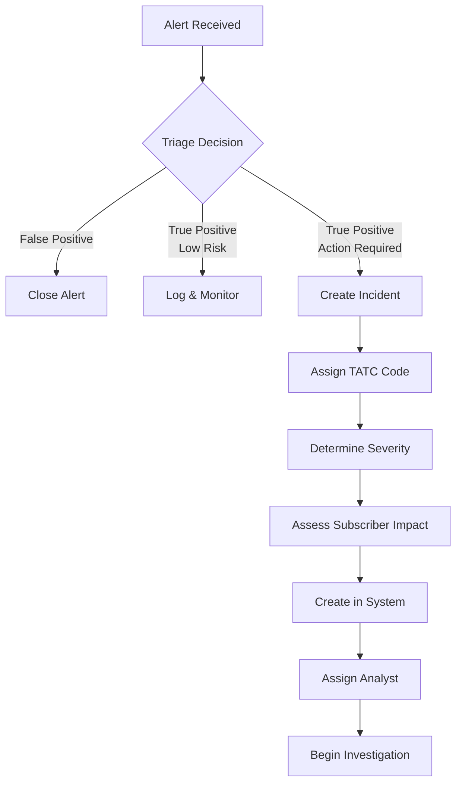
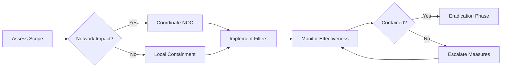
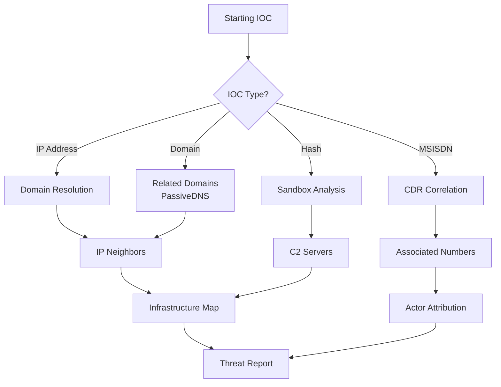

# National SOC Platform - Operational Runbooks & Playbooks

## Document Information
| Field | Value |
|-------|-------|
| **Version** | 1.0.0 |
| **Last Updated** | 2024 |
| **Classification** | Internal Use - SOC Operations |
| **Target Audience** | SOC Analysts, Incident Responders, Threat Hunters |

---

## Table of Contents

1. [Introduction](#introduction)
2. [Quick Reference Cards](#quick-reference-cards)
3. [Incident Management Runbooks](#incident-management-runbooks)
4. [Threat Hunting Playbooks](#threat-hunting-playbooks)
5. [Telecom-Specific Procedures](#telecom-specific-procedures)
6. [Escalation Matrix](#escalation-matrix)
7. [Communication Templates](#communication-templates)

---

## Introduction

### Purpose
This document provides standardized operational procedures for the National Security Operations Center (SOC) platform, specifically designed for **telecom-scale operations (20M+ subscribers)**.

### Scope
- Incident Management procedures
- Threat Intelligence workflows
- Telecom-specific attack response
- Real-time monitoring and alerting
- Analytics-driven decision making

### Key Performance Targets
| Metric | Target | Critical Threshold |
|--------|--------|-------------------|
| MTTR (Critical) | < 2 hours | > 4 hours |
| MTTR (High) | < 8 hours | > 16 hours |
| MTTA (Acknowledge) | < 15 minutes | > 30 minutes |
| SLA Compliance | > 95% | < 90% |
| False Positive Rate | < 15% | > 25% |

---

## Quick Reference Cards

### Severity Classification Matrix

| Level | Name | Response Time | Examples |
|-------|------|---------------|----------|
| **P1** | CRITICAL | Immediate (<15 min) | DDoS affecting >100K subscribers, Network outage, Data breach confirmed |
| **P2** | HIGH | < 1 hour | SS7 attack detected, SIM swap fraud campaign, Major phishing |
| **P3** | MEDIUM | < 4 hours | Suspicious activity pattern, Malware detection, Policy violation |
| **P4** | LOW | < 24 hours | Minor anomaly, Information gathering, Low-risk indicators |

### TATC Code Reference
TATC (Telecom Attack/Threat Classification) codes standardize incident categorization:

```
Format: TATC-YYYY-NNN
- YYYY: Year of classification
- NNN: Sequential number within year

Categories:
- TATC-2024-001 to 099: Network Infrastructure Attacks
- TATC-2024-100 to 199: Subscriber Compromise/Fraud
- TATC-200-299: Protocol Abuse (SS7/GTP/SIP)
- TATC-300-399: Data Exfiltration/Breach
- TATC-400-499: Denial of Service
- TATC-500-599: Insider Threat
- TATC-600-699: Third-party/Supply Chain
- TATC-700-799: Emerging/Unknown
```

---

## Incident Management Runbooks

### RB-001: New Incident Creation

**Trigger**: Alert triage determines incident creation required

#### Procedure



#### Steps

1. **Initial Assessment**
   - Review alert source and initial data
   - Determine if incident criteria met
   - Estimate potential subscriber impact

2. **Classification**
   ```
   POST /api/incidents
   {
     "action": "create",
     "data": {
       "title": "[SEVERITY] Brief description",
       "description": "Detailed technical description",
       "severity": "CRITICAL|HIGH|MEDIUM|LOW",
       "category": "NETWORK_ATTACK|FRAUD|PROTOCOL_ABUSE|...",
       "subscribersAffected": <estimated_count>,
       "sourceIp": "<if applicable>",
       "msisdn": "<if subscriber involved>",
       "tatcCode": "<auto-assigned or manual>"
     }
   }
   ```

3. **Initial Documentation**
   - Add all known IOCs (IPs, domains, hashes, MSISDNs)
   - Link related alerts
   - Set initial phase to `DETECTION`

4. **Notification**
   - P1/P2: Immediate notification to on-call lead
   - Update dashboard with new incident

#### Quality Gates
- [ ] All required fields populated
- [ ] Severity justification documented
- [ ] Initial subscriber impact assessed
- [ ] Related alerts linked
- [ ] Analyst assigned

---

### RB-002: Critical Incident Response (P1)

**Trigger**: Incident classified as CRITICAL severity

#### Timeline Targets
| Phase | Target | Maximum |
|-------|--------|---------|
| Acknowledgment | 5 min | 15 min |
| Initial Containment | 30 min | 60 min |
| Stakeholder Notification | 15 min | 30 min |
| War Room Activation | 30 min | 60 min |
| Status Update | Every 30 min | Every 60 min |

#### Procedure

**Phase 1: Immediate Actions (0-15 minutes)**

```bash
# 1. Acknowledge incident immediately
PUT /api/incidents/{id}
{
  "action": "update",
  "data": {
    "status": "IN_PROGRESS",
    "phase": "TRIAGE"
  }
}

# 2. Send initial notification via SSE
# System auto-emits: incident:status_changed event
```

**Actions Checklist:**
- [ ] Acknowledge incident in system
- [ ] Notify on-call manager (call + SMS + platform notification)
- [ ] Begin evidence preservation
- [ ] Activate logging for related systems
- [ ] Assess scope (subscribers affected, network segments)
- [ ] Document all actions taken

**Phase 2: Containment (15-60 minutes)**



**Containment Options by Type:**

| Attack Type | Primary Containment | Secondary Measures |
|-------------|-------------------|-------------------|
| DDoS | Upstream filtering, Rate limiting | CDN activation, Anycast |
| SS7 Attack | Firewall rules, GT blocking | Operator coordination |
| SIM Swap Fraud | Account freezes, MSISDN blacklist | KYC verification queue |
| Malware | Network segmentation, IDS rules | Endpoint isolation |
| Data Breach | Access revocation, Credential reset | Forensic imaging |

**Phase 3: Communication Protocol**

**Internal Updates (every 30 min):**
```
INCIDENT UPDATE: {TATC_CODE} - {Title}

Status: {current_status}
Phase: {current_phase}
Timeline:
  - Detected: {timestamp}
  - Acknowledged: {timestamp}
  - Containment Started: {timestamp}
  
Subscriber Impact:
  - Potentially Affected: {number}
  - Confirmed Affected: {number}
  - Services Impacted: {list}

Actions Taken:
  1. {action_1}
  2. {action_2}

Next Steps:
  - {next_action_1}
  - {next_action_2}

Lead: {analyst_name}
Next Update: {scheduled_time}
```

---

### RB-003: SS7/SIGTRAN Attack Response

**Trigger**: Detection of anomalous SS7 signaling patterns

#### Background
SS7 (Signaling System No. 7) is the protocol used by telecom networks for call setup, SMS, and other services. Attacks can include location tracking, call interception, and fraud.

#### Indicators of Compromise (IOCs)

| Attack Type | SS7 Message Pattern | Anomaly Indicators |
|-------------|-------------------|-------------------|
| Location Tracking | SRI (Send Routing Info) bursts | >100/min from same OPC |
| Call Interception | PRN (Provide Roaming Number) | Unusual DPC destinations |
| SMS Interception | ForwardInfo IMSI | Targeted high-value MSISDNs |
| Fraud | USSD requests to premium | Revenue-generating patterns |
| DoS | MAP_ERROR floods | Error rate >10% |

#### Response Procedure

**Step 1: Verify and Classify**
```sql
-- Query recent SS7 anomalies
SELECT 
  message_type,
  COUNT(*) as count,
  opc,
  dpc,
  global_title as target_msisdn,
  MAX(anomaly_score) as max_score
FROM ss7_messages 
WHERE timestamp >= NOW() - INTERVAL '1 hour'
  AND anomaly_score > 70
GROUP BY message_type, opc, dpc, global_title
HAVING count > 50
ORDER BY max_score DESC;
```

**Step 2: Assess Impact**
- Identify targeted subscribers (MSISDNs)
- Determine data accessed (location, calls, SMS)
- Calculate financial impact (fraud cases)
- Check for VIP/government targets

**Step 3: Mitigation**
```bash
# Block malicious OPCs (Originating Point Codes)
# Coordinate with signaling firewall team

PUT /api/incidents/{id}
{
  "action": "addUpdate",
  "data": {
    "content": "SS7 mitigation initiated:\n- Blocked OPC: {opc}\n- Firewall rule ID: {rule_id}\n- Coordination ticket: {ticket}",
    "isInternal": true
  }
}
```

**Step 4: Operator Coordination**
For cross-operator attacks, initiate GSMA coordination:
1. Document all evidence (PCAPs, CDRs)
2. Contact peer security team via secure channel
3. Share IOCs through trusted TI platform
4. Coordinate takedown/mitigation timing

---

### RB-004: SIM Swap Fraud Investigation

**Trigger**: Detection of unauthorized SIM swap or fraud pattern

#### Red Flags
- SIM swap request followed by access to banking apps
- Multiple failed authentication then successful swap
- Unusual registration on new device (IMEI change)
- Location mismatch during swap

#### Investigation Steps

**1. Timeline Reconstruction**
```sql
-- Get subscriber activity timeline
SELECT 
  event_type,
  event_timestamp,
  source_ip,
  device_imei,
  location_cell_id
FROM subscriber_events 
WHERE msisdn = '{target_msisdn}'
  AND event_timestamp BETWEEN '{start_date}' AND '{end_date}'
ORDER BY event_timestamp;
```

**2. Verify Legitimacy**
- Contact subscriber via pre-registered alternate method
- Verify identity using security questions/biometrics
- Check store CCTV if physical swap
- Review agent notes if assisted swap

**3. Account Recovery**
- Freeze accounts if compromise confirmed
- Revert SIM to original (if possible)
- Reset all credentials
- Enable enhanced monitoring

**4. Evidence Preservation**
```
Evidence Checklist:
□ SIM swap request form
□ Agent authentication records
□ Device IMEI history
□ Location data at time of swap
□ Account access logs post-swap
□ Financial transaction log
□ Customer verification recording
```

---

## Threat Hunting Playbooks

### TH-001: MSISDN-Based Hunt

**Objective**: Investigate suspicious phone numbers for fraud/malicious activity

#### Pre-requisites
- Valid MSISDN(s) to investigate
- Appropriate authorization (privacy/compliance)
- Clear investigation scope

#### Query Template
```json
POST /api/threat-hunting/sessions
{
  "name": "MSISDN Investigation - {msisdn}",
  "queryType": "MSISDN_LOOKUP",
  "parameters": {
    "msisdn": "{target_msisdn}",
    "timeRange": "30d",
    "dataSources": [
      "cdrs",           // Call detail records
      "sms_logs",       // SMS metadata
      "data_sessions",  // GTP/IP sessions
      "ss7_events",     // Signaling events
      "subscriber_db",  // Account information
      "fraud_scoring"   // Risk scores
    ]
  },
  "analystId": "{your_user_id}"
}
```

#### Analysis Points

**Behavioral Analysis:**
- Call patterns (frequency, destinations, duration)
- SMS patterns (short codes, international, bulk)
- Data usage (volume, destinations, protocols)
- Roaming behavior (unusual locations?)
- Device changes (IMEI history)

**Risk Indicators:**
| Indicator | Normal Range | Suspicious |
|-----------|--------------|------------|
| Calls/day | 5-50 | >200 |
| International % | 5-20% | >60% |
| Unique contacts/day | 3-20 | >100 |
| Data roaming countries/month | 0-3 | >10 |
| IMEI changes/year | 0-2 | >5 |

#### Output Report Structure
```markdown
# MSISDN Investigation Report

## Executive Summary
- **MSISDN**: {number}
- **Investigation Date**: {date}
- **Analyst**: {name}
- **Risk Score**: {0-100}
- **Recommendation**: {CONTINUE_MONITORING / ESCALATE / CLOSE}

## Subscriber Profile
- Registration Date: {date}
- Account Type: {prepaid/postpaid/corporate}
- Current Status: {active/suspended/fraud}
- Last Activity: {date/time}

## Activity Summary (Last 30 Days)
- Total Calls: {count}
- Total SMS: {count}
- Data Sessions: {count}
- Unique Destinations: {count}
- Countries Roamed: {list}

## Findings
### Finding 1: {title}
- **Severity**: {level}
- **Description**: {details}
- **Evidence**: {references}
- **IOC Extracted**: {list}

## Recommendations
1. {recommendation}
2. {recommendation}

## Attached Artifacts
- Session ID: {hunt_session_id}
- Export ID: {export_reference}
```

---

### TH-002: IOC Pivot Investigation

**Objective**: Expand from single indicator to full threat picture

#### Pivot Chain Methodology



#### Execution Steps

**Step 1: Enrich Starting IOC**
```bash
# Get IOC details and relationships
GET /api/threats/{ioc_id}/relationships

# Common pivots:
# IP → Other domains on same server
# Domain → Registrant email → Other domains
# Hash → Family samples
# MSISDN → Same device (IMEI) or same cell tower
```

**Step 2: Automated Expansion**
```json
POST /api/threat-hunting/sessions
{
  "name": "IOC Pivot - {type}:{value}",
  "queryType": "IOC_PIVOT",
  "parameters": {
    "startingIoc": {
      "type": "{ipv4|domain|hash|msisdn}",
      "value": "{value}"
    },
    "pivotDepth": 2,
    "maxResults": 500,
    "includeExternal": true,
    "enrichmentServices": [
      "virustotal",
      "abuseipdb",
      "whoisrdap",
      "shodan",
      "internal_threat_feed"
    ]
  }
}
```

**Step 3: Manual Analysis**
Review automated findings for:
- False positives to exclude
- High-value leads to pursue
- Patterns indicating organized activity
- Links to known threat actors/groups

**Step 4: Create Campaign/Update IOCs**
```bash
# If new campaign discovered
POST /api/threats
{
  "action": "createCampaign",
  "data": {
    "name": "{campaign_name}",
    "threatActor": "{attribution}",
    "ttps": [{technique_id, confidence}],
    "iocs": [{ioc_ids}]
  }
}

# Bulk add new IOCs from hunt
POST /api/threats
{
  "action": "bulkImport",
  "data": {
    "indicators": [{new_iocs}],
    "campaignId": "{campaign_id}",
    "source": "INTERNAL_HUNT",
    "confidence": 85
  }
}
```

---

### TH-003: Campaign Tracking Playbook

**Objective**: Monitor and track active threat campaigns against telecom infrastructure

#### Dashboard Monitoring Setup

**Key Metrics to Track:**
1. **Campaign Activity Volume**
   - New IOCs per hour
   - Alerts triggered per hour
   - Subscribers encountering campaign IOCs

2. **Campaign Reach**
   - Unique affected subscribers
   - Geographic distribution
   - Service types impacted

3. **Campaign Evolution**
   - New TTPs observed
   - Infrastructure changes
   - Timing patterns

#### Automated Hunting Queries

```yaml
# Campaign Monitoring Rules
name: "High-Volume IOC Campaign Detection"
schedule: "*/15 * * * *"  # Every 15 minutes
query: |
  SELECT 
    campaign_id,
    COUNT(new_iocs_last_15m) as ioc_velocity,
    COUNT(alerts_triggered) as alert_velocity,
    COUNT(DISTINCT affected_subscribers) as reach
  FROM campaign_metrics
  WHERE timestamp >= NOW() - INTERVAL '15 minutes'
  GROUP BY campaign_id
  HAVING ioc_velocity > 10 OR alert_velocity > 50 OR reach > 1000

actions:
  - type: notify_analysts
    channels: [sse, slack, email]
    condition: alert_velocity > 100
  
  - type: auto_contain
    condition: reach > 10000 AND confidence > 90
    approval_required: true
```

---

## Telecom-Specific Procedures

### TP-001: Subscriber Impact Assessment

When incidents affect subscribers, follow this assessment procedure:

#### Impact Tiers
| Tier | Subscribers Affected | Action Required |
|------|---------------------|-----------------|
| **MASSIVE** | >1M (5%+) | Emergency protocol, regulatory notification |
| **LARGE** | 100K-1M | Priority response, customer comms prep |
| **MODERATE** | 1K-100K | Standard incident, monitor closely |
| **LIMITED** | <1K | Normal handling, individual outreach if needed |

#### Assessment Query
```sql
-- Count potentially affected subscribers
WITH affected_subscribers AS (
  -- Define your affected population based on incident type
  SELECT DISTINCT msisdn
  FROM {relevant_table}
  WHERE {incident_criteria}
    AND event_time >= '{incident_start}'
    AND event_time <= '{incident_end}'
)
SELECT 
  COUNT(*) as total_affected,
  COUNT(CASE WHEN subscriber_type = 'PREPAID' THEN 1 END) as prepaid,
  COUNT(CASE WHEN subscriber_type = 'POSTPAID' THEN 1 END) as postpaid,
  COUNT(CASE WHEN is_vip = TRUE THEN 1 END) as vip_count,
  COUNT(CASE WHEN is_corporate = TRUE THEN 1 END) as corporate_count
FROM affected_subscribers s
JOIN subscriber_master m ON s.msisdn = m.msisdn;
```

---

### TP-002: Regulatory Compliance Incidents

Certain incidents require regulatory notification:

#### Notification Triggers
- Data breach affecting >100 subscribers
- Network outage >1 hour affecting >10K subscribers
- Confirmed fraud >$50K
- Government/targeted official compromise
- Cross-border attack attribution

#### GSMA Reporting (for telecom-specific)
If incident involves signaling attacks (SS7/Diameter):

1. **Immediate**: Document in internal system
2. **Within 24 hours**: Preliminary report to GSMA ISAO
3. **Within 72 hours**: Detailed technical report
4. **Ongoing**: Coordination with affected operators

---

## Escalation Matrix

### Technical Escalation

| Current Level | Escalate To | Trigger |
|---------------|------------|---------|
| L1 Analyst | L2 Senior Analyst | Stuck >30 min, P1/P2 |
| L2 Analyst | L3 Team Lead | Stuck >1 hour, multi-team |
| Team Lead | SOC Manager | Resource need, major incident |
| SOC Manager | CISO | Regulatory, executive visibility |
| CISO | CEO/Board | Material breach, media risk |

### Business Escalation

| Situation | Notify | Timeline |
|-----------|--------|----------|
| P1 Incident | Duty Manager + Dept Head | Immediate |
| Customer impact >10K | Customer Care Lead | <1 hour |
| Media/risk | Corp Comms + Legal | <1 hour |
| Regulatory trigger | Legal + Compliance | <2 hours |
| Revenue impact >$100K | Finance + Exec | <4 hours |

---

## Communication Templates

### TMPL-001: Initial Incident Notification

```
SUBJECT: [URGENT] {SEVERITY} Incident Declared - {TATC_CODE}

INCIDENT DETAILS:
---------------
Title: {incident_title}
Severity: {severity}
Status: {status}
Declared: {timestamp}
Analyst: {analyst_name}

CURRENT SITUATION:
-----------------
{brief_description_of_what_we_know}

SUBSCRIBER IMPACT:
-----------------
Potentially Affected: {number}
Confirmed Affected: {number}
Services Impacted: {services_list}

IMMEDIATE ACTIONS:
-----------------
1. {action_taken_1}
2. {action_taken_2}

NEXT STEPS:
----------
1. {planned_action_1}
2. {planned_action_2}

NEXT UPDATE: {scheduled_update_time}

CONTACT:
-------
Incident Lead: {name} ({phone}/{slack})
War Room: {location/link}
Conference: {dial-in}

---
This is an automated notification from the National SOC Platform
```

### TMPL-002: Status Update (Periodic)

```
SUBJECT: UPDATE: {TATC_CODE} - {Status} ({time_since_start})

SUMMARY:
-------
Time Active: {duration}
Current Phase: {phase}
Overall Status: {improving/stable/degrading}

KEY METRICS:
-----------
┌─────────────────────┬──────────┬──────────┐│ Metric               │ Previous │ Current  │
├─────────────────────┼──────────┼──────────┤
│ Subscribers Affected│ {prev}   │ {curr}   │
│ Services Restored   │ {prev}   │ {curr}   │
│ Alerts/Hour         │ {prev}   │ {curr}   │
│ Containment %        │ {prev}   │ {curr}   │
└─────────────────────┴──────────┴──────────┘

PROGRESS SINCE LAST UPDATE:
--------------------------✅ {completed_item_1}
✅ {completed_item_2}
⏳ {in_progress_item}
❌ {blocked_item} - {blocker_reason}

DECISIONS NEEDED:
----------------{decision_required_1}
{decision_required_2}

NEXT UPDATE: {scheduled_time}
```

### TMPL-003: Post-Incident Report (PIR)

```markdown
# Post-Incident Report

## 1. Executive Summary
**Incident ID:** {TATC_CODE}
**Title:** {title}
**Duration:** {start_date} to {close_date} ({total_duration})
**Final Severity:** {severity}

### Impact Summary
- **Subscribers Affected:** {final_count}
- **Revenue Impact:** ${amount}
- **Reputation Risk:** {low/medium/high}
- **Regulatory Exposure:** {yes/no - details}

---

## 2. Timeline

| Time (UTC) | Event | Owner |
|------------|-------|-------|
| {timestamp} | {event} | {owner} |
| {timestamp} | {event} | {owner} |

---

## 3. Root Cause Analysis

### What Happened
{description}

### Why It Happened
{root_cause - use 5 whys or fishbone}

### Contributing Factors
- {factor_1}
- {factor_2}

---

## 4. Response Assessment

### What Went Well
- ✅ {positive_1}
- ✅ {positive_2}

### What Could Be Improved
- ❌ {negative_1}
- ❌ {negative_2}

### Metrics vs Targets
| Metric | Target | Actual | Met? |
|--------|--------|--------|------|
| MTTA | 15 min | {actual} | {✅/❌} |
| MTTR | 4 hrs | {actual} | {✅/❌} |
| SLA | 95% | {actual}% | {✅/❌} |

---

## 5. Lessons Learned & Action Items

### Action Items
| # | Action | Owner | Due Date | Status |
|---|--------|-------|----------|--------|
| 1 | {action} | {name} | {date} | Open |
| 2 | {action} | {name} | {date} | Open |

### Process Improvements
- {improvement_1}
- {improvement_2}

---

## 6. Attachments
- [Evidence package]({link})
- [Log exports]({link})
- [Communication timeline]({link})

---

**Report Prepared By:** {analyst_name}
**Report Date:** {date}
**Approved By:** {manager_name}
```

---

## Appendix

### A. API Quick Reference

| Operation | Method | Endpoint | Purpose |
|-----------|--------|----------|---------|
| Create Incident | POST | `/api/incidents` | Create new incident |
| Update Incident | PUT | `/api/incidents/{id}` | Update status/phase |
| Add Comment | PUT | `/api/incidents/{id}` | action=addUpdate |
| Link Alert | PUT | `/api/incidents/{id}` | action=linkAlert |
| Query Incidents | GET | `/api/incidents` | List/search incidents |
| Add IOC | POST | `/api/threats` | action=addIndicator |
| Validate IOC | POST | `/api/threats` | action=validateIOC |
| Bulk Import | POST | `/api/threats` | action=bulkImport |
| Create Hunt | POST | `/api/threat-hunting/sessions` | Start hunt session |
| Get Analytics | GET | `/api/analytics` | Dashboard data |
| Stream Events | GET | `/api/stream/*` | SSE real-time feed |
| Health Check | GET | `/api/incidents/health` | Module status |

### B. Useful Queries

**Active Critical/High Incidents:**
```sql
SELECT * FROM incidents 
WHERE status IN ('NEW', 'IN_PROGRESS', 'ESCALATED')
  AND severity IN ('CRITICAL', 'HIGH')
ORDER BY 
  CASE severity 
    WHEN 'CRITICAL' THEN 1 
    WHEN 'HIGH' THEN 2 
  END,
  created_at ASC;
```

**Today's Incident Metrics:**
```sql
SELECT 
  COUNT(*) as total_incidents,
  COUNT(CASE WHEN severity = 'CRITICAL' THEN 1 END) as critical,
  COUNT(CASE WHEN status = 'RESOLVED' THEN 1 END) as resolved,
  SUM(subscribers_affected) as total_impact
FROM incidents 
WHERE DATE(created_at) = CURRENT_DATE;
```

### C. Contact Directory

| Role | Name | Phone | Slack | Email |
|------|------|-------|------|-------|
| SOC Manager | - | - | @soc-manager | soc@telco.com |
| On-Call L2 | - | - | @oncall-l2 | - |
| NOC Liaison | - | - | @noc-liaison | noc@telco.com |
| Legal | - | - | @legal-sec | legal@telco.com |
| Corp Comms | - | - | @comms | comms@telco.com |
| CISO | - | - | @ciso | ciso@telco.com |

---

*Document maintained by SOC Operations Team*
*Last review: {date}*
*Next scheduled review: {date + 6 months}*
