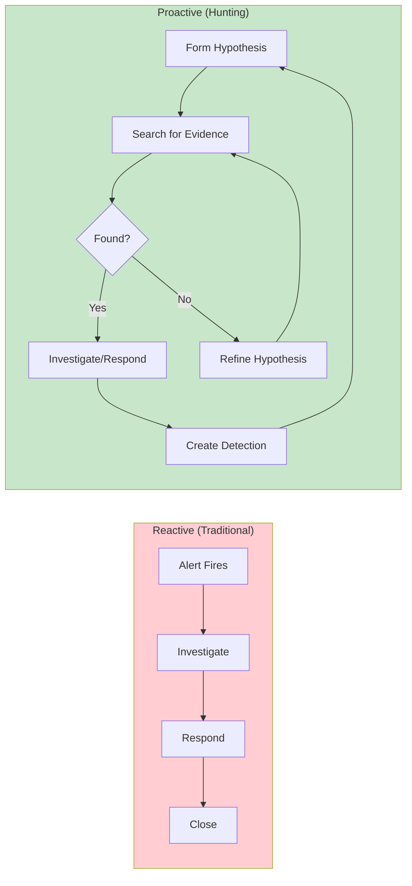
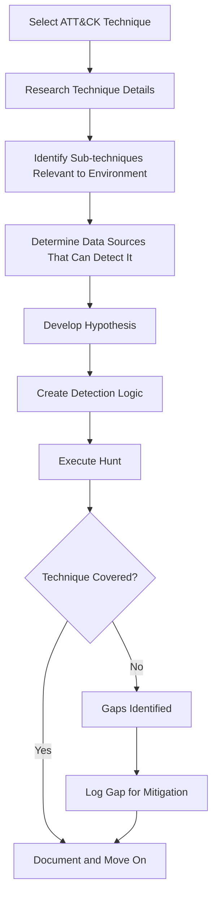
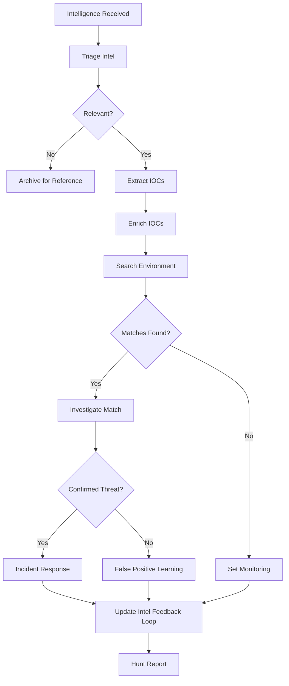
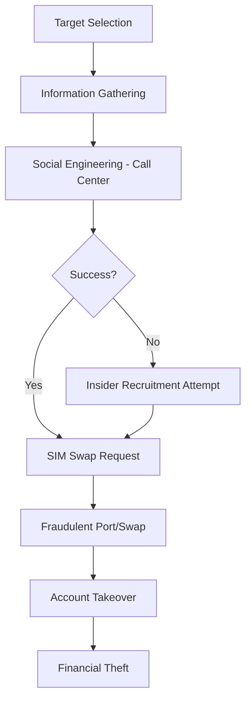

# Advanced Threat Hunting Training

**Document ID:** SOC-TRN-002  
**Version**: 1.5  
**Classification**: Internal Training Material  
**Last Updated:** January 2025  
**Owner:** Djezzy National SOC Threat Hunting Team

---

## Table of Contents

1. [Course Overview](#course-overview)
2. [Hypothesis-Based Hunting Methodology](#hypothesis-based-hunting-methodology)
3. [MITRE ATT&CK Framework Mapping](#mitre-attck-framework-mapping)
4. [Advanced Query Techniques](#advanced-query-techniques)
5. [Threat Intelligence Integration](#threat-intelligence-integration)
6. [Case Studies: Algerian Telecom Sector](#case-studies-algerian-telecom-sector)

---

## Course Overview

### Target Audience

This advanced training is designed for:
- SOC Analysts with 6+ months experience
- Threat Hunters seeking structured methodology
- Incident Responders wanting proactive skills
- Security Engineers developing detection capabilities

### Prerequisites

Before attending this course, participants must have:
- Completed SOC Analyst Fundamentals (SOC-TRN-001) or equivalent
- Minimum 6 months hands-on SOC experience
- Proficiency with Wazuh, GRR, and at least one query language
- Understanding of networking and operating systems fundamentals
- Basic knowledge of MITRE ATT&CK framework

### Learning Objectives

Upon completion, participants will be able to:

| Objective | Description | Assessment |
|-----------|-------------|------------|
| **LO1** | Develop testable threat hypotheses | Hypothesis development exercise |
| **LO2** | Map hypotheses to MITRE ATT&CK techniques | Framework mapping quiz |
| **LO3** | Write complex queries across multiple data sources | Practical lab |
| **LO4** | Integrate threat intelligence into hunting operations | Intelligence exercise |
| **LO5** | Document and communicate hunt findings | Written report |
| **LO6** | Convert hunts to detection rules | Rule creation project |

### Course Duration

| Module | Duration | Format |
|--------|----------|--------|
| Methodology | 4 hours | Lecture + Workshop |
| ATT&CK Deep Dive | 4 hours | Lecture + Mapping Lab |
| Query Techniques | 8 hours | Hands-on Intensive |
| Threat Intel Integration | 4 hours | Lecture + Exercise |
| Case Studies | 4 hours | Group Analysis |
| Capstone Hunt | 8 hours | Practical Project |
| **Total** | **32 hours** | **4-5 days** |

---

## Hypothesis-Based Hunting Methodology

### What is Threat Hunting?

Threat hunting is the proactive search for threats that have evaded existing security controls. Unlike alert-driven incident response, hunting assumes the adversary may already be inside.



### The Hunting Lifecycle

#### Phase 1: Hypothesis Development

A hypothesis is a testable statement about potential adversary activity in your environment.

**Hypothesis Formula:**
```
I believe that [THREAT ACTOR / TECHNIQUE] 
may be present in our environment, 
evidenced by [OBSERVABLE BEHAVIOR], 
which I can detect by querying [DATA SOURCE] for [SPECIFIC INDICATORS].
```

**Example Hypotheses:**

| # | Hypothesis | Data Source | Technique |
|---|-----------|-------------|-----------|
| H1 | An attacker with initial access via phishing is attempting credential dumping using comsvcs.dll on domain-joined workstations | GRR EDR + Wazuh | T1003.003 (OS Credential Dumping) |
| H2 | APT group targeting telecom is using DNS tunneling for C2 communications, utilizing newly registered .tk domains | Zeek DNS logs + Suricata | T1048.003 (Exfiltration Over Alternative Protocol) |
| H3 | Insider threat is exfiltrating subscriber data via personal email using base64 encoding in attachments | Proxy logs + DLP alerts | T1567.002 (Exfiltration to Web Service) |

**Hypothesis Quality Criteria:**

| Criterion | Good Example | Poor Example |
|-----------|--------------|--------------|
| **Specific** | "Attacker using Mimikatz via PowerShell on servers" | "Someone might be doing something bad" |
| **Testable** | Can be verified with available data | Requires unavailable telemetry |
| **Actionable** | Finding leads to response | Finding has no clear action |
| **Relevant** | Based on current threat intel or risk | Random exploration without context |

#### Phase 2: Data Collection & Query Development

Translate hypothesis into executable queries:

```python
# Hypothesis H1 Implementation Example
# Hunting for credential dumping via comsvcs.dll

class CredentialDumpingHunt:
    """
    Hypothesis: Attackers are using comsvcs.dll MiniDump 
    technique for credential extraction.
    
    MITRE ATT&CK: T1003.003 - OS Credential Dumping:
    Operating System utilities that dump credentials.
    """
    
    def __init__(self):
        self.queries = {
            'wazuh': """
                SELECT * FROM alerts 
                WHERE rule.id IN (
                    '550', '554',  # Process creation rules
                    '553'          # New file creation
                )
                AND full_log LIKE '%comsvcs%'
                AND timestamp > now() - interval '7 days'
            """,
            
            'grr_flows': [
                {'name': 'FileFinder', 
                 'params': {'path_regex': '.*dump.*\\.dmp', 'path': '/tmp,/Users/*/Downloads'}},
                {'name': 'YaraScan',
                 'params': {'rules_path': '/opt/yara/credential_dump.yara'}}
            ],
            
            'zeek': """
                SELECT * FROM files 
                WHERE filename LIKE '%dump%' 
                  AND mime_type = 'application/x-dmp'
                  AND ts > now() - interval '7 days'
            """
        }
        
    def execute_hunt(self):
        """Execute all queries and correlate results"""
        results = {}
        
        # Execute Wazuh query
        results['wazuh_alerts'] = self.query_wazuh(self.queries['wazuh'])
        
        # Execute GRR flows on target systems
        results['grr_artifacts'] = self.execute_grr_flows(self.queries['grr_flows'])
        
        # Query Zeek for suspicious file transfers
        results['network_files'] = self.query_zeek(self.queries['zeek'])
        
        return self.correlate(results)
```

#### Phase 3: Analysis & Pattern Recognition

Look for patterns that confirm or refute your hypothesis:

**Pattern Types to Identify:**

| Pattern Type | Description | Example |
|-------------|-------------|---------|
| **Temporal** | Events clustered in time | Multiple credential accesses at 3 AM |
| **Spatial** | Events from same location/source | Same source IP accessing multiple hosts |
| **Behavioral** | Similar actions across entities | Same unusual command on multiple systems |
| **Anomalous** | Deviation from baseline | User suddenly accessing new systems |
| **Correlated** | Related events across sources | Network connection + file creation + process execution |

#### Phase 4: Response & Detection Enhancement

If hypothesis confirmed:

1. **Immediate Response**
   - Contain affected systems
   - Preserve evidence
   - Initiate incident if warranted

2. **Detection Creation**
   - Convert hunt query to detection rule
   - Add to SIEM/correlation engine
   - Document for team awareness

3. **Knowledge Sharing**
   - Brief stakeholders
   - Update threat model
   - Improve defenses

### Hunt Documentation Template

```markdown
# THREAT HUNT REPORT

**Hunt ID:** HUNT-[YEAR]-[SEQUENCE]  
**Date Range:** [START] - [END]  
**Lead Hunter:** [NAME]

---

## Executive Summary
[2-3 paragraph summary suitable for management]

## Hypothesis Statement
> [Original hypothesis as stated before hunt]

## Methodology
### Data Sources Used
- [Source 1]: [What was queried, why]
- [Source 2]: [What was queried, why]

### Queries Executed
[Document key queries used]

## Findings

### Positive Indicators Found
| Indicator | Source | Context | Confidence |
|-----------|--------|---------|------------|
| | | | |

### False Positives Identified
| Indicator | Reason for FP | Tuning Recommendation |
|-----------|---------------|---------------------|

### Anomalies Noted (Unconfirmed)
| Anomaly | Why Interesting | Follow-up Needed |
|---------|----------------|------------------|

## Conclusion
**Hypothesis Status:** □ Confirmed □ Partially Confirmed □ Refuted □ Inconclusive

### If Confirmed:
- Scope of compromise: [Description]
- Recommended actions: [List]
- Detections created: [References]

### If Refuted:
- Why refuted: [Evidence of absence]
- Value of hunt anyway: [What we learned]

## Lessons Learned
1. 
2. 

## Next Steps
- [ ] Follow-up hunt: [Description]
- [ ] Detection to create: [Rule idea]
- [ ] Control to improve: [Recommendation]

---
*Report Classification: Internal Use Only*
```

---

## MITRE ATT&CK Framework Mapping

### Understanding ATT&CK for Telecom

The MITRE ATT&CK® framework provides a knowledge base of adversary tactics and techniques based on real-world observations. For telecommunications environments, certain techniques are particularly relevant.

#### High-Priority Techniques for Telecom SOC

Based on threat intelligence and industry analysis, these techniques should be prioritized:

**Initial Access (TA0001)**

| Technique ID | Name | Telecom Relevance | Detection Difficulty |
|--------------|------|-------------------|---------------------|
| T1566.001 | Spearphishing Attachment | High - Targeted attacks on employees | Medium |
| T1190 | Exploit Public-Facing Application | Critical - Web portals, APIs | High |
| T1078 | Valid Accounts | High - Compromised credentials | High |
| T0865 | Supply Chain Compromise | Medium - Vendor access | Very High |

**Credential Access (TA0006)**

| Technique ID | Name | Telecom Relevance | Detection Difficulty |
|--------------|------|-------------------|---------------------|
| T1003.001 | LSASS Memory | Critical - Domain admin access | Medium |
| T1003.003 | comsvcs/MiniDump | High - Evasion technique | Medium-High |
| T1110.003 | Brute Force | High - Subscriber portal attacks | Low |
| T1557 | Portal Account | Critical - Customer account takeover | Medium |

**Collection (TA0009)**

| Technique ID | Name | Telecom Relevance | Detection difficulty |
|--------------|------|-------------------|---------------------|
| T1005 | Data from Local System | Medium | Low |
| T1113 | Screen Capture | Low-Medium | High |
| T1213 | Data from Information Repositories | **Critical - Subscriber DB** | Medium |
| T1029 | Scheduled Transfer | **Critical - CDR/Billing data** | Medium-High |
| T1056.001 | Input Capture: Keylogging | Medium | High |

**Command & Control (TA0011)**

| Technique ID | Name | Telecom Relevance | Detection Difficulty |
|--------------|------|-------------------|---------------------|
| T1071.001 | Web: C2 Channels | High | Medium |
| T1001.003 | DNS: DNS over HTTPS | Medium-High | High |
| T1572 | Protocol Tunneling | Medium | High |
| T1092 | Communication through Permitted Software | Medium | High |

**Impact (TA0040)**

| Technique ID | Name | Telecom Relevance | Detection Difficulty |
|--------------|------|-------------------|---------------------|
| T1486 | Data Encrypted for Impact | **Critical - Ransomware** | Medium |
| T1489 | Service Stop | High - Core network services | Low |
| T1534 | Internal Proxy | Medium - Traffic redirection | Medium |
| T1531 | Account Access Removal | Medium - Subscriber lockout | Low |

### Mapping Hunts to ATT&CK

Use this process to ensure comprehensive coverage:



### ATT&CK Coverage Matrix Template

Track your organization's detection coverage:

| Tactic | TID | Technique Name | Coverage Level | Detection Method | Last Tested |
|--------|-----|----------------|----------------|------------------|-------------|
| Initial Access | T1190 | Exploit Public-Facing App | □ None □ Partial □ Good | WAF + App Logs | YYYY-MM-DD |
| Execution | T1059.001 | PowerShell | □ None □ Partial □ Good | EDR + Script Log | YYYY-MM-DD |
| Persistence | T1547.001 | Registry Run Keys | □ None □ Partial □ Good | FIM + EDR | YYYY-MM-DD |
| ... | ... | ... | ... | ... | ... |

**Coverage Definitions:**
- **None:** No detection capability exists
- **Partial:** Some sub-techniques or scenarios covered
- **Good:** Reliable detection for most scenarios

---

## Advanced Query Techniques

### SQL Advanced Patterns for PostgreSQL

The SOC platform uses PostgreSQL as its primary database. Master these patterns:

#### Time-Series Analysis

```sql
-- Detect anomalies in event volume over time
WITH hourly_counts AS (
    SELECT 
        DATE_TRUNC('hour', created_at) AS hour,
        COUNT(*) AS event_count,
        source_type
    FROM events
    WHERE created_at >= NOW() - INTERVAL '7 days'
    GROUP BY hour, source_type
),
stats AS (
    SELECT 
        source_type,
        AVG(event_count) AS avg_count,
        STDDEV(event_count) AS std_count,
        PERCENTILE_CONT(0.95) WITHIN GROUP (ORDER BY event_count) AS p95_count
    FROM hourly_counts
    GROUP BY source_type
)
SELECT 
    h.hour,
    h.source_type,
    h.event_count,
    s.avg_count,
    s.p95_count,
    CASE 
        WHEN h.event_count > s.p95_count * 2 THEN 'ANOMALOUS_HIGH'
        WHEN h.event_count < s.avg_count * 0.1 THEN 'ANOMALOUS_LOW'
        ELSE 'NORMAL'
    END AS anomaly_flag
FROM hourly_counts h
JOIN stats s ON h.source_type = s.source_type
WHERE h.event_count > s.p95_count * 2 OR h.event_count < s.avg_count * 0.1
ORDER BY h.hour DESC;
```

#### Graph/Relationship Queries

```sql
-- Find users who accessed similar sets of sensitive tables
-- May indicate coordinated activity or shared compromised account

WITH user_table_access AS (
    SELECT DISTINCT
        username,
        table_name,
        DATE(access_time) AS access_date
    FROM audit_log
    WHERE table_name IN ('subscribers', 'imsi_mapping', 'cdr_archive')
      AND access_time >= NOW() - INTERVAL '30 days'
),
user_access_patterns AS (
    SELECT 
        a.username AS user_a,
        b.username AS user_b,
        COUNT(*) AS common_tables,
        array_agg(DISTINCT a.table_name) AS shared_tables
    FROM user_table_access a
    JOIN user_table_access b 
        ON a.table_name = b.table_name 
        AND a.access_date = b.access_date
        AND a.username < b.username
    GROUP BY a.username, b.username
    HAVING COUNT(*) >= 3  -- Accessed 3+ same sensitive tables
)
SELECT *
FROM user_access_patterns
ORDER BY common_tables DESC;
```

#### Sessionization Analysis

```sql
-- Analyze authentication sessions for impossible travel or sharing

WITH auth_events AS (
    SELECT 
        username,
        client_ip,
        geoip_country(client_ip) AS country,
        geoip_city(client_ip) AS city,
        event_time,
        LAG(event_time) OVER (PARTITION BY username ORDER BY event_time) AS prev_time,
        LAG(client_ip) OVER (PARTITION BY username ORDER BY event_time) AS prev_ip,
        ROW_NUMBER() OVER (PARTITION BY username ORDER BY event_time) AS rn
    FROM authentication_log
    WHERE success = true
      AND event_time >= NOW() - INTERVAL '24 hours'
),
session_analysis AS (
    SELECT *,
        EXTRACT(EPOCH FROM (event_time - prev_time)) / 3600 AS hours_since_prev,
        CASE 
            WHEN country != geoip_country(prev_ip) THEN 'COUNTRY_CHANGE'
            WHEN city != geoip_city(prev_ip) THEN 'CITY_CHANGE'
            ELSE 'SAME_LOCATION'
        END AS location_change
    FROM auth_events
    WHERE rn > 1
)
SELECT *
FROM session_analysis
WHERE 
    -- Impossible travel: different country within 4 hours
    (location_change = 'COUNTRY_CHANGE' AND hours_since_prev < 4)
    OR
    -- Suspicious rapid location change
    (location_change = 'CITY_CHANGE' AND hours_since_prev < 1)
ORDER BY event_time DESC;
```

### Zeek/Zq Advanced Queries

Zq is the modern query language for Zeek logs:

```zq
# Complex network behavior detection

# Long-lived connections that transferred significant data
filter(
    duration > 10min && bytes > 10MB,
    read_conn("conn.log")
)

# DNS queries to domains with high entropy (possible DGA)
let entropy(s: string) = count(for c in set(s) -> {c}) / len(s)
filter(
    entropy(query) > 3.5 && !query endsWith(djezzy.dz) && !query endsWith(.google.com),
    read_dns("dns.log")
)

# Potential Kerberos attacks: unusual ticket types
filter(
    service == "kerberos" && proto == "udp" && bytes > 2000,
    read_conn("conn.log")
)

# Beaconing detection: regular intervals in connections
let intervals = cut(id.orig_h, id.resp_h, id.resp_p, 
                    map(each(cut(ts, id.resp_h)), 
                        {ts, next_ts=next(ts)}))
filter(
    abs(next_ts - ts) < stddev(next_ts - ts) * 0.1,
    intervals
)
```

### YARA Rule Development

Develop custom YARA rules for threat hunting:

```yaml
// Rule: Telecom-specific credential stealer detection
// Context: Malware targeting telecom employee credentials

rule Telecom_Credential_Stealer {
    meta:
        description = "Detects potential credential stealing malware targeting telecom environment"
        author = "Djezzy SOC"
        date = "2025-01-15"
        version = "1.0"
        mitre_tactic = "Credential Access"
        mitre_technique = "T1003"
        severity = "high"

    strings:
        // Strings related to telecom databases
        $db_subscriber = "subscriber" nocase wide ascii
        $db_cdr = "call_detail" nocase wide ascii
        $db_imsi = "imsi" nocase wide ascii
        
        // Credential-related API calls
        $cred_api1 = "CredReadDomainCredentials" ascii wide
        $cred_api2 = "CryptUnprotectData" ascii wide
        $cred_api3 = "WlanGetProfile" ascii wide
        
        // Network indicators of C2
        $c2_path1 = "/api/callback" ascii
        $c2_path2 = "/exfil" ascii
        $user_agent = "TelecomClient/" ascii wide
        
        // Suspicious encryption patterns
        $enc_pattern = { 89 50 4E 47 }  // PNG header (steganography?)
        $base64_pattern = /[A-Za-z0-9+/]{40,}={0,2}/

    condition:
        // Main condition: credential stealing behavior
        any of ($cred_*) 
        and (
            // With telecom targeting
            any of ($db_*)
            or
            // Or C2 communication
            2 of ($c2_*)
        )
        and filesize < 5MB
}

// Rule: DNS Tunneling Detection via YARA (on PCAPs/parsed DNS)
// Note: This would typically run on extracted strings from network captures

rule DNS_Tunneling_Tool {
    meta:
        description = "Detects known DNS tunneling tool artifacts"
        severity = "critical"
    
    strings:
        // iodine/dns2tcp signatures
        $iodine_str1 = "iodine" nocase ascii
        $iodine_str2 = "-f" ascii // iodine frequent flag
        $dnscat_str = "dnscat" nocase ascii
        $tun_str1 = ".tunnel" nocase ascii
        $tun_str2 = ".dns" nocase wide
        
        // High entropy subdomain pattern (DGA-like)
        $high_entropy_domain = /[a-z]{20,}\.(tk|ml|ga|cf|gq)\./ ascii nocase

    condition:
        any of ($*) and filesize < 500KB
}
```

### GRR Artifact Collection

Custom artifact definitions for advanced hunting:

```yaml
# Custom GRR Artifacts for Telecom Environment

name: LinuxTelecomHunt
doc: >
  Comprehensive artifact collection for hunting in Linux telecom servers.

sources:
- type: ARTIFACT_GROUP
  attributes:
    names:
      # System information
      - LinuxAllUsers
      - LinuxRunningProcesses
      - LinuxNetworkConnections
      - Linux listening_ports
      
      # Authentication artifacts
      - LinuxAuthLogs
      - LinuxSSHConfig
      - LinuxSudoersUsage
      
      # File system hunting
      - LinuxFindTmpFiles
      - LinuxRecentFiles
      - LinuxHiddenFiles
      
      # Cron/Scheduled tasks
      - LinuxCronActivities
      
      # Package management (detect backdoored packages)
      - LinuxDPKG
      - LinuxRPM_Packages

---
name: WindowsTelecomWorkstationHunt
doc: >
  Artifact collection for Windows workstations in telecom environment.

sources:
- type: ARTIFACT_GROUP
  attributes:
    names:
      # Standard Windows artifacts
      - WindowsScheduledTasks
      - WindowsServices
      - WindowsRegistryUsers
      - WindowsAMCache
      - WindowsPrefetchFiles
      
      # Browser history (for initial access investigation)
      - WindowsChromeHistory
      - WindowsFirefoxHistory
      
      # Office macros (common attack vector)
      - WindowsOfficeMruLists
      
      # PowerShell history (critical!)
      - WindowsPowerShellConsoleHistory
      - WindowsPowerShellScripts
      
      # Remote access tools
      - WindowsRemoteDesktopFiles
      - WindowsRDPSettings
      - WindowsCachedDLLs
```

---

## Threat Intelligence Integration

### Intelligence Sources for Djezzy SOC

| Source | Type | Content | Integration Method |
|--------|------|---------|-------------------|
| **Internal MISP** | IOC Database | Community + internal IOCs | Automated correlation |
| **OpenCTI** | Platform | Full TI lifecycle | API integration |
| **ANRT Sharing** | Government | National-level threats | Manual + automated |
| **GSMA** | Industry | Mobile-specific threats | Reports + feeds |
| **Commercial Feeds** | Paid | Premium IOCs | API integration |
| **OSINT** | Open Source | General threat landscape | Manual research |

### Intelligence-Led Hunting Workflow



### Building Intelligence Queries

```python
# intelligence_hunter.py
# Framework for intelligence-led threat hunting

import requests
from datetime import datetime, timedelta
from typing import List, Dict, Any

class IntelligenceHunter:
    """Integrate threat intelligence into hunting operations"""
    
    def __init__(self, misp_url, misp_key, opencti_url, opencti_key):
        self.misp_url = misp_url
        self.misp_key = misp_key
        self.opencti_url = opencti_url
        self.opencti_key = opencti_key
        
    def get_recent_threat_actors(self, days: int = 7) -> List[Dict]:
        """Get active threat actors from OpenCTI"""
        # Query for intrusion sets with recent activity
        query = '''
        query {
            intrusionSets(first: 20) {
                edges {
                    node {
                        id
                        name
                        aliases
                        description
                        objectMarking {
                            edges {
                                node {
                                    definition
                                    x_opencti_color
                                }
                            }
                        }
                        firstSeen
                        lastSeen
                        objectLabel {
                            edges {
                                node {
                                    value
                                }
                            }
                        }
                    }
                }
            }
        }
        '''
        result = self._opencti_query(query)
        return self._parse_intrusion_sets(result)
    
    def get_actor_ttps(self, actor_id: str) -> List[str]:
        """Get MITRE ATT&CK techniques used by threat actor"""
        query = f'''
        {{
            intrusionSet(id: "{actor_id}") {{
                objectIncludes {{
                    edges {{
                        node {{
                            ... on AttackPattern {{
                                name
                                x_mitre_id
                                killChainPhases {{
                                    phase_name
                                }}
                            }}
                        }}
                    }}
                }}
            }}
        }}
        '''
        result = self._opencti_query(query)
        return self._parse_attack_patterns(result)
    
    def extract_actor_iocs(self, actor_id: str) -> Dict[str, List]:
        """Extract all IOCs associated with threat actor"""
        iocs = {'ips': [], 'domains': [], 'hashes': [], 'urls': []}
        
        # Get stix bundles from MISP for this actor
        misp_search = {
            'type': ['ip-dst', 'domain', 'md5', 'sha256', 'url'],
            'tag': f'threat-actor:{actor_id}',
            'publish_timestamp': (datetime.now() - timedelta(days=90)).strftime('%Y-%m-%d')
        }
        
        resp = requests.post(
            f'{self.misp_url}/attributes/restSearch',
            headers={'Authorization': self.misp_key},
            json=misp_search
        )
        
        for attr in resp.json().get('Attribute', []):
            type_map = {
                'ip-dst': 'ips',
                'domain': 'domains',
                'md5': 'hashes',
                'sha256': 'hashes',
                'urls': 'urls'
            }
            target = type_map.get(attr.get('type'))
            if target:
                iocs[target].append(attr.get('value'))
        
        return iocs
    
    def generate_hunt_queries(self, iocs: Dict[str, List]) -> List[str]:
        """Generate platform-specific queries from IOCs"""
        queries = []
        
        # SQL queries for internal database
        if iocs['ips']:
            ip_list = "', '".join(iocs['ips'][:100])  # Limit for performance
            queries.append(f"""
                SELECT * FROM network_connections 
                WHERE remote_ip IN ('{ip_list}')
                AND connection_time > NOW() - INTERVAL '30 days'
                ORDER BY connection_time DESC
            """)
        
        if iocs['domains']:
            domain_list = "', '".join(iocs['domains'][:50])
            queries.append(f"""
                SELECT * FROM dns_queries 
                WHERE query_name ~* '\\.({domain_list.replace(".", "\\.")})$'
                AND query_time > NOW() - INTERVAL '30 days'
            """)
        
        # Wazuh query format
        if iocs['hashes']:
            for hash_val in iocs['hashes']:
                queries.append(f'search={hash_val}&rule.level=7+')
        
        return queries
    
    def _opencti_query(self, query: str) -> Dict:
        """Execute GraphQL query against OpenCTI"""
        resp = requests.post(
            f'{self.opencti_url}/graphql',
            headers={'Authorization': f'Bearer {self.opencti_key}'},
            json={'query': query}
        )
        return resp.json()
    
    def _parse_intrusion_sets(self, data: Dict) -> List[Dict]:
        """Parse OpenCTI response for intrusion sets"""
        # Implementation depends on actual response structure
        return []
    
    def _parse_attack_patterns(self, data: Dict) -> List[str]:
        """Parse attack patterns from response"""
        return []
```

### Creating Detection Rules from Intelligence

When intelligence indicates a new threat, create detections:

```yaml
# Sigma rule converted from threat intelligence
# Source: Campaign targeting Algerian telecom sector

title: Suspicious Telecom Database Access Pattern
id: djezzy_soc_2025_001
status: experimental
description: |
  Detects access patterns consistent with subscriber data harvesting.
  Based on threat intelligence report [REPORT-ID] regarding APT-X targeting 
  North African telecommunications providers.
references:
  - https://internal.intel/reports/2025/q1/apt-x-telecom
author: Djezzy SOC Threat Hunting Team
date: 2025/01/15
modified: 2025/01/15
logsource:
  product: postgresql
  service: audit
detection:
  selection_source:
    table_name|contains:
      - subscribers
      - imsi_mapping
      - msisdn_lookup
  selection_volume:
    rows_returned|gt: 1000
  selection_timing:
    query_time:
      - between: ['22:00', '06:00']
      - weekday: [5, 6]  # Weekend
  condition: selection_source and selection_volume and selection_timing
falsepositives:
  - Legitimate reporting queries during maintenance windows
  - Authorized data exports
level: high
tags:
  - attack.collection
  - attack.t1213
  - apt.x
  - telecom.targeted
```

---

## Case Studies: Algerian Telecom Sector

### Case Study 1: SS7/Diameter Signaling Attack

**Background:**
In 2024, a major Algerian telecommunications provider experienced a sophisticated attack leveraging SS7 protocol vulnerabilities to track high-value targets and intercept SMS-based 2FA codes.

**Attack Timeline:**

| Phase | Date | Activity | Detection Method |
|-------|------|----------|------------------|
| Reconnaissance | Jan 15 | Subscriber enumeration via signaling probes | Unusual signaling volumes |
| Initial Access | Jan 22 | SS7 routing manipulation | Diameter monitoring |
| Action | Jan 25-Feb 10 | Location tracking of 47 targets | Location query anomalies |
| Exfiltration | Feb 8-12 | Intercepted 2FA codes forwarded | SMS delivery failures reported |
| Discovery | Feb 14 | Security team alerted to complaints | Customer reports + anomaly detection |

**Lessons Learned:**
1. Signaling layer monitoring is essential for telecom SOC
2. Cross-reference customer complaints with technical data
3. Implement roaming partner security verification
4. Deploy signaling firewall with strict rules

**Detection Rules Developed:**
```yaml
# Rule: Unusual SS7 location queries
title: High Volume Location Requests for Single Subscriber
description: Detect potential tracking via excessive location queries
condition: location_requests_per_subscriber > 50 AND time_window < 1 hour
severity: critical

# Rule: SMS Interception Indicators
title: SMS Delivery Failure After Successful Routing
description: Possible interception - message routed but not delivered
condition: sms_routed_success AND delivery_failed AND destination_in_target_set
severity: critical
```

### Case Study 2: SIM Swapping Fraud Ring

**Background:**
Organized fraud ring exploited social engineering and insider assistance to perform unauthorized SIM swaps, enabling account takeovers of cryptocurrency and banking accounts.

**Attack Pattern:**



**Indicators of Compromise (IOCs):**

| Category | Indicator |
|----------|-----------|
| **Behavioral** | Multiple SIM swap requests for same subscriber |
| **Behavioral** | Call center calls from same number about different accounts |
| **Technical** | Port-in requests followed immediately by 2FA usage |
| **Technical** | Device change + immediate high-value transaction |
| **Insider** | Employee accessing records outside normal territory |

**Hunting Queries:**
```sql
-- Find potential SIM swap fraud patterns
WITH port_events AS (
    SELECT 
        msisdn,
        port_type,  -- port-in, port-out, swap
        request_time,
        requesting_employee_id,
        reason_code,
        LAG(request_time) OVER (PARTITION BY msisdn ORDER BY request_time) AS prev_port
    FROM sim_port_log
    WHERE request_time >= NOW() - INTERVAL '30 days'
),
suspicious_patterns AS (
    SELECT *
    FROM port_events
    WHERE port_type = 'swap'
      AND EXISTS (
          SELECT 1 FROM port_events p2 
          WHERE p2.msisdn = port_events.msisdn 
            AND p2.port_type = 'swap'
            AND p2.request_time > port_events.request_time - INTERVAL '7 days'
            AND p2.request_id != port_events.request_id
      )
)
SELECT * 
FROM suspicious_patterns
ORDER BY request_time DESC;
```

### Case Study 3: Ransomware Targeting Billing Systems

**Background:**
Ransomware variant specifically configured to target telecommunications billing systems, threatening service interruption and subscriber data exposure.

**Key Observations:**

| Observation | Technical Detail |
|-------------|-------------------|
| **Entry Vector** | Phishing email to finance department |
| **Lateral Movement** | PSExec, SMB exploitation |
| **Target Selection** | Files matching *.billing, *.cdr, *.invoice |
| **Encryption** | AES-256 + RSA-2048 hybrid |
| **C2 Communication** | DNS tunneling to .cc domains |
| **Demand** | 2 BTC (~$80,000 at time) |

**Hunt Hypothesis Applied:**
```
"I believe ransomware targeting billing data may be present, 
evidenced by mass file modifications to .billing/.cdr extensions 
with subsequent DNS queries to newly registered domains, 
which I can detect by correlating FIM alerts with DNS logs."
```

**Outcome:**
- Hunt conducted proactively after external report of similar attack
- No evidence found in Djezzy environment
- Detection rules deployed based on IOCs
- Response playbook updated

---

## Appendix: Hunting Toolkit Reference

### Essential Tools

| Tool | Purpose | Platform | License |
|------|---------|----------|---------|
| **Velociraptor** | Endpoint hunting | Cross-platform | Open Source (AGPL) |
| **Chainsaw** | Windows forensics | Windows | Open Source |
| **Plaso (log2timeline)** | Timeline analysis | Cross-platform | Open Source |
| **CyberChef** | Data transformation | Web (offline capable) | Open Source |
| **Sigma** | Detection rule format | Universal | Open Source |
| **YARA** | Pattern matching | Cross-platform | Open Source |
| **Zeek (zq)** | Network log analysis | Linux | Open Source |
| **Jupyter Notebooks** | Analysis workspace | Cross-platform | Open Source |

### Useful Python Libraries

```python
# Recommended libraries for threat hunting automation

# Data analysis
import pandas as pd           # Data manipulation
import numpy as np            # Numerical operations
import plotly.express as px   # Visualization

# Security specific
from pymisp import PyMISP     # MISP integration
from shodan import Shodan     # Internet scanning
import virustotal3            # VirusTotal API
import pythonwhois            # WHOIS lookups

# Graph/relationship analysis
import networkx as nx         # Graph algorithms
from neo4j import GraphDatabase  # Graph database

# Utility
import hashlib                # Hash calculations
import base64                 # Encoding/decoding
from datetime import datetime  # Time handling
import re                     # Regex patterns
```

---

**END OF TRAINING DOCUMENT**

*For questions, contact: soc-threat-hunting@djezzy.dz*
