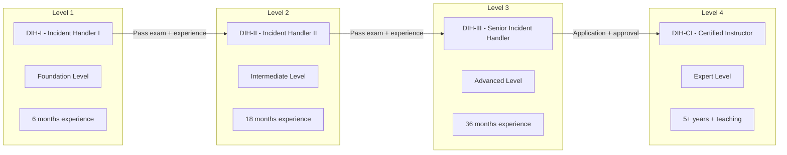
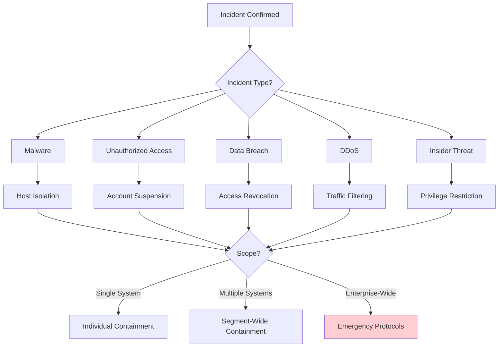
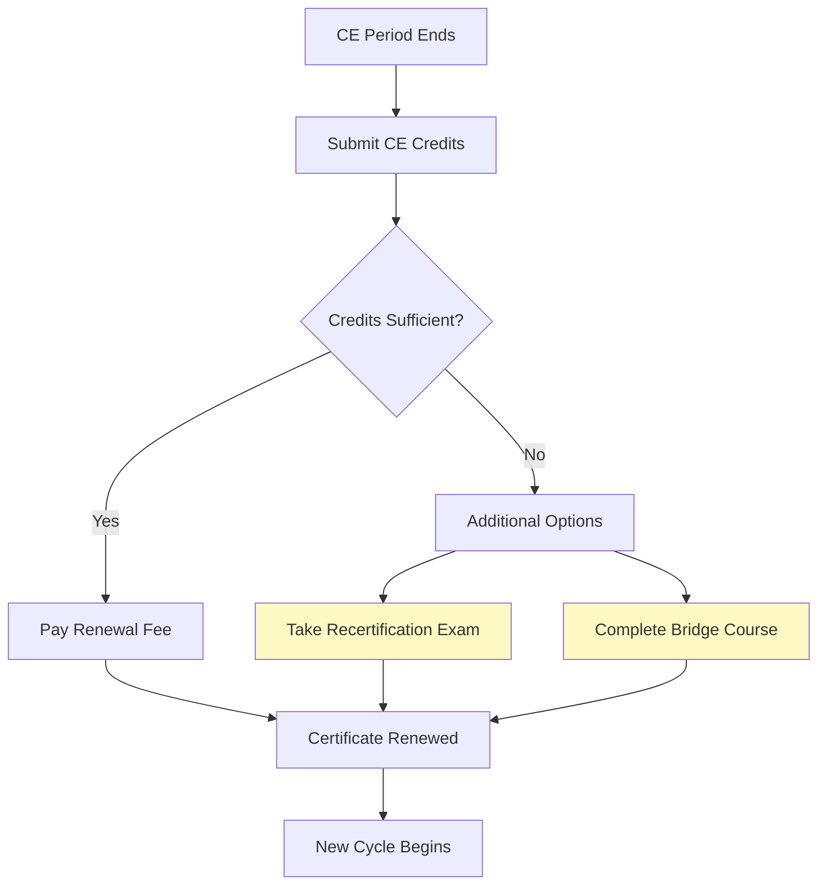

# Incident Handler Certification Path

**Document ID:** SOC-TRN-003  
**Version**: 1.5  
**Classification**: Internal Training Material  
**Last Updated:** January 2025  
**Owner:** Djezzy National SOC Training & Certification Team

---

## Table of Contents

1. [Program Overview](#program-overview)
2. [Required Knowledge Areas](#required-knowledge-areas)
3. [Practical Exercises](#practical-exercises)
4. [Certification Exam Blueprint](#certification-exam-blueprint)
5. [Continuing Education Requirements](#continuing-education-requirements)

---

## Program Overview

### Certification Levels

The Djezzy National SOC Incident Handler Certification program establishes competency standards for security incident responders:



### Certification Benefits

| Benefit | Description |
|---------|-------------|
| **Career Progression** | Required for promotion to senior analyst and IC roles |
| **Recognition** | Industry-recognized within Algerian telecom sector |
| **Authority** | Certified to lead incident response activities |
| **Compensation** | Tied to salary band advancement |
| **External Opportunities** | Recognized by ANRT for regulatory requirements |

### Prerequisites by Level

| Requirement | DIH-I | DIH-II | DIH-II | DIH-CI |
|-------------|-------|--------|--------|--------|
| **SOC Analyst Fundamentals** | Required | Required | Required | Required |
| **Advanced Threat Hunting** | Recommended | Required | Required | Required |
| **ANRT Compliance Training** | Recommended | Required | Required | Required |
| **Minimum Experience** | 6 months | 18 months | 36 months | 5+ years |
| **Incidents Handled (as support)** | 10+ | 50+ | 100+ | N/A |
| **Incidents Led (as primary)** | - | 5+ | 25+ | N/A |
| **Training Delivered** | - | - | - | 40+ hours |

---

## Required Knowledge Areas

### Domain 1: Incident Response Fundamentals (15%)

#### Learning Objectives

1.1 Understand the incident response lifecycle per NIST SP 800-61  
1.2 Differentiate between events, incidents, and breaches  
1.3 Apply the Djezzy SOC severity classification system  
1.4 Execute proper evidence handling procedures  
1.5 Document incidents according to organizational standards  

#### Key Concepts

**Incident vs Event:**

| Characteristic | Security Event | Security Incident | Data Breach |
|----------------|---------------|-------------------|-------------|
| **Definition** | Observable occurrence | Adverse event confirmed | Incident with data exposure |
| **Example** | Failed login attempt | Successful unauthorized access | Customer data exfiltrated |
| **Response** | Monitor/Log | Investigate/Respond | Legal/Regulatory action |
| **Reporting** | Internal log only | Incident ticket | Regulatory notification |

**NIST Incident Response Lifecycle:**

```mermaid
stateDiagram-v2
    [*] --> Preparation: Always Ready
    Preparation --> Detection: Alert Triggered
    Detection --> Analysis: Initial Assessment
    Analysis --> Containment: Confirmed Incident
    Containment --> Eradication: Threat Neutralized
    Eradication --> Recovery: System Clean
    Recovery --> Post-Incident: Lessons Learned
    Post-Incident --> Preparation: Improvements Applied
```

**Evidence Handling Fundamentals:**

```
Order of Volatility (Collection Priority):
1. Registers, Cache          ← Collect FIRST (most volatile)
2. Memory (RAM)
3. Network State (connections, routes, ARP)
4. Running Processes
5. Logged-in Users
6. Open Files
7. Disk/File Systems         ← Collect LAST (most stable)
8. Archived Logs
9. Physical Configuration
10. Remote Logging Data
```

### Domain 2: Detection and Analysis (25%)

#### Learning Objectives

2.1 Analyze alerts from multiple detection sources  
2.2 Perform initial triage using standardized procedures  
2.3 Identify common attack patterns and indicators  
2.4 Correlate events across security tools  
2.5 Determine scope and impact of security events  

#### Detection Source Mastery

**SIEM Analysis (Wazuh):**

| Skill | Description | Proficiency Expected |
|-------|-------------|----------------------|
| Query construction | Build effective searches | Advanced filters, aggregations |
| Rule interpretation | Understand alert meaning | All standard rules |
| False positive identification | Recognize benign patterns | 90%+ accuracy |
| Timeline creation | Reconstruct event sequences | Multi-source correlation |

**EDR Analysis (GRR):**

| Capability | Use Case | When to Deploy |
|------------|----------|---------------|
| File Finder | Locate suspicious files | Unknown malware location |
| GetFile | Retrieve artifacts | Evidence collection |
| YARAScan | Pattern matching | Known malware variants |
| ListProcesses | Process enumeration | Persistence discovery |
| NetworkConnections | Network visibility | C2 identification |
| RegistryQuery | Windows registry | Persistence mechanisms |

**Network Analysis (Suricata/Zeek/Arkime):**

| Tool | Primary Use | Key Queries |
|------|-------------|-------------|
| Suricata | Signature-based detection | EVE JSON analysis |
| Zeek | Protocol analysis | conn.log, dns.log, http.log |
| Arkime | Full packet capture | Session reconstruction, PCAP export |

### Domain 3: Containment Strategies (20%)

#### Learning Objectives

3.1 Select appropriate containment strategy by incident type  
3.2 Execute network-level containment measures  
3.3 Perform endpoint containment actions  
3.4 Implement credential and access containment  
3.5 Document containment decisions and rationale  

#### Containment Decision Framework



**Containment Techniques Reference:**

| Technique | Implementation | Rollback Difficulty | Business Impact |
|-----------|---------------|---------------------|-----------------|
| **IP Block (Firewall)** | iptables/nftables rule | Easy | May affect legitimate traffic |
| **Host Isolation** | VLAN change / port block | Moderate | Host completely offline |
| **Account Disable** | LDAP/AD modification | Easy | User cannot work |
| **Process Termination** | kill/GRR KillProcess | Difficult (evidence) | Application stops |
| **DNS Sinkhole** | DNS server configuration | Easy | Affects all users of domain |
| **Service Shutdown** | systemctl stop | Easy | Service unavailable |

### Domain 4: Eradication and Recovery (15%)

#### Learning Objectives

4.1 Remove malware and persistence mechanisms  
4.2 Validate complete threat removal  
4.3 Restore systems to known-good state  
4.4 Verify service functionality post-recovery  
4.5 Implement enhanced monitoring post-incident  

**Malware Removal Checklist:**

```markdown
## ERADICATION CHECKLIST

### Pre-Eradication
- [ ] Evidence fully preserved (forensic images if needed)
- [ ] Scope of compromise documented
- [ ] Containment in place and verified
- [ ] Stakeholders notified of impending actions

### Malware Removal
- [ ] All malicious files identified and deleted
- [ ] Registry persistence removed (Run keys, Services, etc.)
- [ ] Scheduled tasks cleaned
- [ ] Web shells identified and removed
- [ ] Backdoor accounts deleted
- [ ] Modified binaries restored or reinstalled

### Credential Reset
- [ ] All compromised passwords changed
- [ ] API keys regenerated
- [ ] Certificates reissued (if private key exposed)
- [ ] SSH keys regenerated
- [ ] Session tokens invalidated
- [ ] MFA devices re-enrolled

### Validation
- [ ] Full antivirus scan clean
- [ ] YARA scan shows no matches
- [ ] No suspicious processes running
- [ ] No unexpected network connections
- [ ] Baseline behavior restored

### Recovery
- [ ] Systems patched to current level
- [ ] Configurations hardened
- [ ] Monitoring enhanced
- [ ] Access reviews completed
- [ ] Documentation updated
```

### Domain 5: Communication and Coordination (10%)

#### Learning Objectives

5.1 Prepare internal status communications  
5.2 Draft management escalation notifications  
5.3 Coordinate with external parties (law enforcement, regulators)  
5.4 Conduct effective shift handovers during incidents  
5.5 Lead incident briefing sessions  

**Communication Matrix:**

| Audience | Timing | Content Detail | Format |
|----------|--------|----------------|--------|
| **SOC Team** | Real-time | Technical details, actions needed | Chat/Verbal |
| **IT Operations** | As needed | System changes, maintenance | Ticket/Email |
| **Management** | Per SLA | Impact, status, business implications | Brief/Email |
| **Legal** | Immediately if trigger | Facts only, preserve privilege | Secure channel |
| **Executives** | Critical only | Executive summary, decisions needed | Presentation |
| **External (ANRT)** | Per regulation | Required fields, factual | Formal report |
| **Public/Media** | Never directly | Via Communications team only | Approved statement |

### Domain 6: Tools and Technologies (10%)

#### Learning Objectives

6.1 Operate core SOC platform components  
6.2 Execute investigations using security tools  
6.3 Integrate data from multiple sources  
6.4 Automate repetitive tasks where appropriate  

**Tool Proficiency Requirements:**

| Tool Category | Specific Tools | Required Proficiency |
|--------------|----------------|---------------------|
| **SIEM** | Wazuh | Query, rule interpretation, alert investigation |
| **EDR** | GRR | Artifact collection, flow execution, analysis |
| **SOAR** | TheHive/Cortex | Case management, analyzer usage |
| **Threat Intel** | MISP/OpenCTI | IOC search, campaign analysis |
| **NSM** | Suricata/Zeek/Arkime | Log analysis, session extraction |
| **Platform** | Djezzy SOC App | Full operational capability |

### Domain 7: Regulatory and Compliance (5%)

#### Learning Objectives

7.1 Understand ANRT security incident requirements  
7.2 Execute data protection procedures (IMSI/MSISDN)  
7.3 Maintain audit-ready documentation  
7.4 Support regulatory inquiries and audits  

**Key Regulatory Requirements:**

| Regulation | Authority | Key Requirement | Deadline |
|------------|-----------|-----------------|----------|
| Cyber Incident Notification | ANRT | Report significant security incidents | 24-72 hours |
| Personal Data Breach | DPA | Notify affected individuals/data authority | 72 hours |
| Telecommunications Security | ANRT | Maintain security controls | Continuous |
| Electronic Communications | Government | Ensure service integrity | Continuous |

---

## Practical Exercises

### Exercise Portfolio

Candidates must complete practical exercises demonstrating competency:

#### Exercise 1: Initial Response Simulation (DIH-I)

**Scenario:** You receive an alert at 14:30 indicating potential malware on workstation FIN-023.

**Tasks:**
1. Acknowledge the alert within SLA
2. Gather initial information about the alert
3. Assess preliminary severity
4. Determine if immediate escalation is warranted
5. Begin documentation

**Time Limit:** 30 minutes  
**Evaluation Criteria:**
- Acknowledgment timeliness
- Information gathering completeness
- Severity assessment accuracy
- Documentation quality

#### Exercise 2: Investigation and Containment (DIH-II)

**Scenario:** The malware from Exercise 1 is confirmed as true positive. It appears to be credential-stealing malware that has been active for approximately 48 hours.

**Tasks:**
1. Determine scope of compromise
2. Identify affected systems and accounts
3. Develop containment plan
4. Execute containment actions
5. Preserve necessary evidence
6. Communicate status to stakeholders

**Time Limit:** 90 minutes  
**Evaluation Criteria:**
- Investigation thoroughness
- Containment appropriateness
- Evidence handling correctness
- Communication effectiveness

#### Exercise 3: Complex Incident Management (DIH-III)

**Scenario:** During investigation of the malware incident, you discover evidence suggesting this may be part of a larger APT campaign targeting telecommunications providers in North Africa. Multiple systems show signs of compromise, and there's evidence of data exfiltration including subscriber records.

**Tasks:**
1. Coordinate multi-team response
2. Manage executive communications
3. Assess regulatory notification requirements
4. Interface with legal regarding law enforcement
5. Develop eradication and recovery strategy
6. Plan post-incident activities

**Time Limit:** 180 minutes (may be split across sessions)  
**Evaluation Criteria:**
- Leadership effectiveness
- Strategic decision-making
- Regulatory awareness
- Comprehensive planning

#### Exercise 4: Forensic Evidence Collection (All Levels)

**Scenario:** You need to collect forensic evidence from a compromised server for potential legal proceedings.

**Tasks:**
1. Prepare evidence collection toolkit
2. Create chain of custody documentation
3. Collect volatile evidence in proper order
4. Acquire disk image
5. Verify evidence integrity
6. Package and secure evidence

**Time Limit:** 60 minutes  
**Evaluation Criteria:**
- Procedure adherence
- Chain of custody completeness
- Evidence integrity verification
- Documentation quality

### Exercise Submission Requirements

Each exercise must include:

1. **Completed Worksheet** - With all tasks addressed
2. **Supporting Documentation** - Screenshots, logs, outputs
3. **Reflective Analysis** - What went well, what could improve
4. **Time Log** - Actual time spent on each task

---

## Certification Exam Blueprint

### Examination Structure

#### DIH-I Examination

| Section | Questions | Time | Weight | Passing Score |
|---------|-----------|------|--------|---------------|
| Domain 1: Fundamentals | 15 | 20 min | 15% | Must achieve 70%+ |
| Domain 2: Detection | 25 | 35 min | 25% | Must achieve 70%+ |
| Domain 3: Containment | 20 | 28 min | 20% | Must achieve 70%+ |
| Domain 4: Eradication | 15 | 21 min | 15% | Must achieve 70%+ |
| Domain 5: Communication | 10 | 14 min | 10% | Must achieve 70%+ |
| Domain 6: Tools | 10 | 14 min | 10% | Must achieve 70%+ |
| Domain 7: Compliance | 5 | 7 min | 5% | Must achieve 70%+ |
| **Total** | **100** | **140 min** | **100%** | **Overall 75%** |

#### DIH-II Examination

Adds practical component:

| Component | Format | Duration | Weight |
|-----------|--------|----------|--------|
| Written Exam | Multiple choice + scenario | 120 min | 60% |
| Practical Lab | Hands-on investigation | 90 min | 40% |
| **Total** | | **210 min** | **100%** |

#### DIH-III Examination

Includes leadership assessment:

| Component | Format | Duration | Weight |
|-----------|--------|----------|--------|
| Written Exam | Scenario-based analysis | 90 min | 30% |
| Practical Lab | Complex incident simulation | 120 min | 35% |
| Oral Board | Panel interview | 45 min | 25% |
| Portfolio Review | Exercise submission review | Pre-submitted | 10% |
| **Total** | | **255 min+** | **100%** |

### Sample Examination Questions

#### Domain 1 Sample (Fundamentals)

**Question:** According to NIST SP 800-61, which phase involves identifying and documenting the incident?

A) Preparation Phase  
B) Detection and Analysis Phase  
C) Containment, Eradication, and Recovery Phase  
D) Post-Incident Activity Phase  

*Correct Answer: B*

**Question:** What is the correct order of volatility for evidence collection?

A) Disk → Memory → Network → Processes  
B) Registers → Memory → Network → Disk  
C) Network → Memory → Processes → Disk  
D) Processes → Memory → Network → Disk  

*Correct Answer: B*

#### Domain 2 Sample (Detection)

**Question:** An analyst receives an alert showing multiple authentication failures followed by a successful login from the same source IP, after which large database queries are executed. Which attack pattern does this most closely represent?

A) Brute force attack only  
B) Credential stuffing leading to data access  
C) SQL injection attempt  
D) Denial of service preparation  

*Correct Answer: B*

**Question:** When investigating an alert from Wazuh showing rule ID 550 fired (new process), what additional information should you gather FIRST?

A) Run a YARA scan on the system  
B) Check the full_log field for process details  
C) Isolate the network connection  
D) Contact the system owner  

*Correct Answer: B*

#### Domain 3 Sample (Containment)

**Question:** You've confirmed ransomware on a critical database server. The server contains subscriber data that must be protected. What is your PRIMARY containment action?

A) Immediately power off the server  
B) Isolate at network level while keeping system running for forensics  
C) Take a snapshot before any action  
D) Wait for management approval before acting  

*Correct Answer: B*

**Question:** Under what circumstances would you choose NOT to contain an immediately?

A) When evidence collection might be impacted  
B) When the incident is P1 severity  
C) When malware is actively spreading  
D) Never - always contain immediately  

*Correct Answer: A*

#### Domain 4 Sample (Eradication)

**Question:** After removing malware from a system, what is the MOST important validation step?

A) Update antivirus signatures  
B) Reboot the system  
C) Run comprehensive scanning with multiple tools  
D) Restore from backup  

*Correct Answer: C*

**Question:** Why is credential reset important even if passwords weren't explicitly stolen?

A) Best practice requirement  
B) Session tokens may have been captured  
C) Keyloggers may have captured input  
D) All of the above  

*Correct Answer: D*

### Scoring and Results

| Score Range | Result | Action |
|-------------|--------|--------|
| 90-100% | Distinction | Certificate with honors |
| 80-89% | Pass | Certificate awarded |
| 75-79% | Conditional Pass | Remediation required within 30 days |
| 70-74% | Fail | May retake after 30 days |
| <70% | Fail | Additional training required |

---

## Continuing Education Requirements

### Certification Maintenance

Certified Incident Handlers must maintain their certification through continuing education:

#### CE Credit Requirements

| Level | CE Credits Required | Cycle | Activities Eligible |
|-------|---------------------|-------|---------------------|
| DIH-I | 20 credits | 2 years | Training, conferences, self-study |
| DIH-II | 30 credits | 2 years | Above plus presentations, publications |
| DIH-III | 40 credits | 2 years | Above plus mentoring, committee work |
| DIH-CI | 50 credits | 2 years | Above plus teaching, curriculum development |

#### Credit Values

| Activity | Credits | Maximum per Cycle |
|----------|---------|-------------------|
| **Training Courses** | | |
| Official SOC training (per hour) | 2 | 24 |
| External security training (per hour) | 1 | 20 |
| Online course completion (per hour) | 1 | 16 |
| **Conferences** | | |
| Major conference attendance (per day) | 3 | 12 |
| Local meetup attendance (per event) | 1 | 8 |
| **Contributions** | | |
| Presentation delivered (per hour) | 4 | 16 |
| Article/blog post published | 3 | 12 |
| New detection rule deployed | 2 | 10 |
| Hunt report completed | 2 | 10 |
| **Leadership** | | |
| Mentoring junior analyst (per quarter) | 2 | 8 |
| Committee/workgroup participation | 1 | 8 |
| Training delivery (per hour) | 4 | 24 |

### Recertification Process



### Certification Revocation

Certification may be revoked for:

| Grounds | Process | Appeal |
|---------|---------|--------|
| **Ethical Violation** | Immediate suspension pending investigation | Written appeal to certification board |
| **CE Non-compliance** | 90-day grace period, then inactive status | Submit missing credits |
| **Competence Concern** | Skills assessment required | Retake examination |
| **Misrepresentation** | Immediate revocation | Formal appeal process |

---

## Appendix: Certification Code of Ethics

All certified individuals agree to:

1. **Protect Society** - Act in the public interest
2. **Act Honorably** - Maintain high ethical standards
3. **Maintain Competency** - Stay current through CE
4. **Advance the Profession** - Share knowledge appropriately
5. **Protect Confidentiality** - Respect privacy obligations
6. **Due Diligence** - Perform work thoroughly
8. **Report Violations** - Report ethics violations

**Acknowledgment Statement:**

> "I hereby affirm that I will uphold the Djezzy SOC Incident Handler Code of Ethics in my professional practice. I understand that violation of these principles may result in revocation of my certification."

---

**END OF CERTIFICATION DOCUMENT**

*For questions, contact: soc-certification@djezzy.dz*
