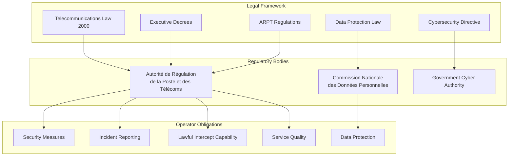
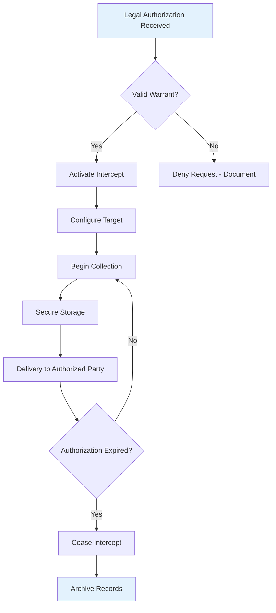
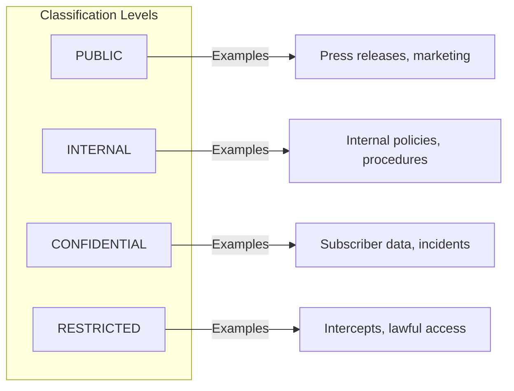
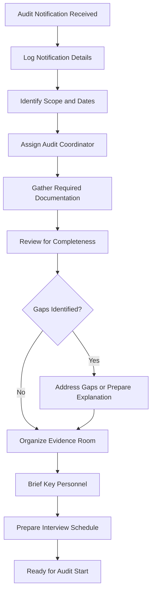

# ANRT Compliance Training

**Document ID:** SOC-TRN-004  
**Version**: 1.5  
**Classification**: Internal Training Material  
**Last Updated:** January 2025  
**Owner:** Djezzy National SOC Compliance Team

---

## Table of Contents

1. [Course Overview](#course-overview)
2. [Regulatory Requirements Overview](#regulatory-requirements-overview)
3. [Data Handling Procedures](#data-handling-procedures)
4. [Audit Preparation](#audit-preparation)
5. [Privacy Protection - IMSI/MSISDN Masking](#privacy-protection---imsimsisdn-masking)
6. [Reporting Obligations](#reporting-obligations)

---

## Course Overview

### Target Audience

This training is **mandatory** for:
- All SOC analysts (initial and annual refresher)
- Incident handlers
- Security engineers
- Anyone with access to subscriber data
- Management with security oversight responsibilities

### Regulatory Context

Algeria's telecommunications sector operates under specific regulatory frameworks that impact security operations:



### Learning Objectives

Upon completion, participants will be able to:

| Objective | Description | Assessment |
|-----------|-------------|------------|
| **LO1** | Identify applicable regulations for telecom security | Written quiz |
| **LO2** | Handle subscriber data according to legal requirements | Practical scenario |
| **LO3** | Execute proper data masking and anonymization | Hands-on exercise |
| **LO4** | Prepare for regulatory audits | Documentation review |
| **LO5** | Fulfill incident reporting obligations to ANRT | Scenario-based test |
| **LO6** | Recognize and report privacy violations | Case analysis |

### Course Duration

| Module | Duration | Format |
|--------|----------|--------|
| Regulatory Framework | 2 hours | Lecture |
| Data Protection Requirements | 2 hours | Lecture + Discussion |
| Practical Data Handling | 2 hours | Hands-on Lab |
| Audit Preparation | 1 hour | Workshop |
| Incident Reporting | 1 hour | Lecture + Exercise |
| Assessment | 30 min | Quiz |
| **Total** | **8.5 hours** | **1 day** |

---

## Regulatory Requirements Overview

### Primary Regulations

#### 1. Telecommunications Law (Loi n° 00-03 du 5 août 2000)

**Key Security Provisions:**

| Article | Requirement | SOC Relevance |
|---------|-------------|----------------|
| Article 9 | Confidentiality of communications | Cannot monitor content without authorization |
| Article 10 | Interception only per legal process | Lawful intercept procedures |
| Article 11 | Operator security obligations | Implement appropriate measures |
| Article 12 | Subscriber data protection | Protect personal information |

**Implementation in SOC:**
- All access to communication content requires legal authorization
- Security monitoring focuses on metadata, not content (without warrant)
- Clear separation between security operations and lawful intercept

#### 2. Executive Decree on Cybersecurity (Décret exécutif n° 18-XX)

**Security Measure Categories:**

| Category | Required Measures | Verification Method |
|----------|------------------|---------------------|
| **Organizational** | Security policy, roles, training | Policy documentation |
| **Technical** | Firewalls, IDS/IPS, encryption | Technical assessment |
| **Operational** | Monitoring, incident response | Procedure review |
| **Physical** | Access control, environmental | Site inspection |

#### 3. ANRT Decision on Security Incidents (Décision ANRT n° XXX)

**Incident Notification Requirements:**

| Trigger | Notification Timeline | Content Required |
|---------|---------------------|------------------|
| Security breach affecting service | Within 24 hours | Initial notification |
| Subscriber data compromise | Within 72 hours | Full report |
| Significant infrastructure attack | Immediate + 24h report | Technical details |
| Service disruption > 4 hours | Within 4 hours | Impact assessment |

#### 4. Data Protection Law (Protection des données à caractère personnel)

**Principles:**

| Principle | Description | Implementation |
|-----------|-------------|----------------|
| **Purpose Limitation** | Collect only for specified purposes | Access logging, purpose justification |
| **Data Minimization** | Collect only necessary data | Field-level access controls |
| **Accuracy** | Keep data accurate and current | Update procedures |
| **Storage Limitation** | Retain only as long as needed | Retention schedules |
| **Security** | Appropriate protection measures | Encryption, access control |
| **Accountability** | Demonstrate compliance | Audit trails, documentation |

### Telecom-Specific Obligations

#### IMSI/MSISDN Protection

The International Mobile Subscriber Identity (IMSI) and Mobile Station International Subscriber Directory Number (MSISDN) are considered particularly sensitive:

| Data Element | Sensitivity Level | Special Protections |
|--------------|------------------|---------------------|
| **IMSI** | Critical | Never display in full; encrypted at rest |
| **MSISDN** | High | Masked in most views; audit all access |
| **IMEI** | Medium | Normal protection with logging |
| **Location Data** | Critical | Aggregated only; no individual tracking without warrant |
| **CDR Metadata** | High | Anonymized for analysis; original secured |
| **Call/SMS Content** | Critical | Lawful intercept only; never in SOC without authorization |

#### Lawful Intercept Requirements

Telecommunications operators must maintain capability for authorized interception:



**SOC Role in Lawful Intercept:**
- SOC does NOT perform lawful intercept activities
- Separate team handles LI requests
- SOC may detect anomalies that suggest unauthorized intercept attempts
- Any suspected unauthorized intercept must be reported immediately

---

## Data Handling Procedures

### Data Classification Matrix

All data handled by SOC must be classified:



| Level | Definition | Examples | Handling Requirements |
|-------|-------------|----------|----------------------|
| **PUBLIC** | No restriction | Published reports, public FAQs | Standard handling |
| **INTERNAL** | Internal use only | Procedures, runbooks | Not for external sharing |
| **CONFIDENTIAL** | Sensitive business data | Subscriber info, incidents | Encrypted, access controlled |
| **RESTRICTED** | Highest sensitivity | LI data, executive comms | Compartmentalized, audited |

### Access Control Requirements

#### Need-to-Know Principle

Access to subscriber data must be justified by operational need:

| Role | Default Access | Justified Access Requires |
|------|---------------|--------------------------|
| **L1 Analyst** | Aggregated/anonymized only | Ticket approval from L2/L3 |
| **L2 Analyst** | Masked MSISDN | Active investigation assignment |
| **L3 Analyst / IC** | Full access during incident | Incident Commander approval |
| **Compliance Officer** | Audit access | Audit scope definition |

#### Access Request Process

```
┌─────────────────────────────────────────────────────────────┐
│                  DATA ACCESS REQUEST FORM                   │
├─────────────────────────────────────────────────────────────┤
│                                                              │
│ Requester Information:                                       │
│   Name: __________________  Employee ID: ____________       │
│   Role: __________________  Department: ____________        │
│                                                              │
│ Data Requested:                                             │
│   Type: □ IMSI  □ MSISDN  □ Location  □ CDR  □ Other       │
│   Specific Fields: ________________________________________  │
│   Number of Records: _______  Date Range: ______________     │
│                                                              │
│ Business Justification (Required):                           │
│   ________________________________________________________  │
│   ________________________________________________________  │
│                                                              │
│ Incident/Ticket Reference (if applicable): _______________   │
│                                                              │
│ Approvals Required:                                          │
│   □ Direct Supervisor                                       │
│   □ Data Steward (for bulk/subscriber data)                 │
│   □ CISO (for RESTRICTED data)                              │
│   □ DPO (for data export)                                   │
│                                                              │
│ Access Duration: □ One-time  □ Session  □ 24hr  □ 7 days    │
│                                                              │
│ Requester Acknowledgment:                                    │
│   I understand this access is logged and audited.            │
│   I will only use data for the stated purpose.               │
│   I will not copy/store data beyond authorized systems.      │
│                                                              │
│ Signature: __________________  Date: __________________      │
│                                                              │
└─────────────────────────────────────────────────────────────┘
```

### Data Masking Standards

#### When to Apply Masking

| Situation | Masking Required | Format |
|-----------|-----------------|--------|
| Dashboard displays | Yes | Partial mask |
| Reports (internal) | Yes | Partial or hash |
| Reports (external/regulator) | Yes | Aggregate or pseudonymize |
| Investigation (active) | No - with authorization | Full view with logging |
| Export files | Yes | Hash or encrypt |
| Log files | Yes | Hash sensitive fields |
| Backup files | Yes | Encrypt entire backup |

#### Masking Formats

**MSISDN Masking:**

```python
def mask_msisdn(msisdn: str, level: str = "standard") -> str:
    """
    Apply MSISDN masking based on access level.
    
    Args:
        msisdn: Full MSISDN (e.g., +213551234567)
        Level: standard, partial, investigation
        
    Returns:
        Masked MSISDN string
    """
    if level == "standard":
        # Show only country code and first 2 digits
        # +21355*******
        return msisdn[:6] + "*" * (len(msisdn) - 6)
        
    elif level == "partial":
        # Show more digits but mask middle
        # +2135512****67
        return msisdn[:7] + "*" * 4 + msisdn[-2:]
        
    elif level == "investigation":
        # Full number with warning marker
        # [UNMASKED]+213551234567
        return f"[UNMASKED]{msisdn}"
    
    return msisdn

# Examples:
# mask_msisdn("+213551234567", "standard")   → "+21355******"
# mask_msisdn("+213551234567", "partial")    → "+2135512****67"
# mask_msisdn("+213551234567", "investigation") → "[UNMASKED]+213551234567"
```

**IMSI Masking:**

```python
def mask_imsi(imsi: str) -> str:
    """
    IMSI should almost never be displayed in full.
    Always show hashed version except during active investigation.
    
    IMSI format: MCC (3) + MNC (2-3) + MSIN (up to 10)
    Example: 603021201234567 (Djezzy Algeria)
    """
    import hashlib
    
    if len(imsi) == 15:
        # Return only MCC+MNC (network identifier) + masked MSIN
        network_part = imsi[:5]  # 60302 = Djezzy Algeria
        return f"{network_part}{'*' * 10}"
    
    # For any display, prefer hash
    return hashlib.sha256(imsi.encode()).hexdigest()[:16]

# Examples:
# mask_imsi("603021201234567") → "60302**********" or "a1b2c3d4e5f6g7h8"
```

**Location Data Masking:**

```python
def mask_location(lat: float, lon: float, precision: str = "cell") -> tuple:
    """
    Mask location data to appropriate precision.
    
    Precision levels:
    - cell: Cell tower level (~500m radius) - default for analytics
    - area: City/district level (~5km radius) - for reports
    - region: Governorate level - for aggregated stats
    """
    import math
    
    if precision == "cell":
        # Round to ~500m precision (3 decimal places approx)
        return (round(lat, 3), round(lon, 3))
        
    elif precision == "area":
        # Round to ~5km precision (2 decimal places)
        return (round(lat, 2), round(lon, 2))
        
    elif precision == "region":
        # Round to ~50km precision (1 decimal place)
        return (round(lat, 1), round(lon, 1))
    
    return (lat, lon)

# Note: For individual tracking, location should be aggregated,
# never stored as precise coordinates linked to identity.
```

### Secure Data Handling Checklist

Before accessing or processing subscriber data:

```markdown
## SUBSCRIBER DATA HANDLING CHECKLIST

### Pre-Access Verification
□ I have a legitimate business need for this data
□ My access authorization is current and appropriate
□ The specific data fields requested are necessary
□ I have documented the purpose of access

### During Access
□ I am accessing only the minimum data required
□ I am viewing data only on approved systems
□ I am not copying data to local/unauthorized storage
□ I am not sharing credentials or access with others
□ Unmasked data is visible only to me (screen position)

### After Access
□ I have logged out of the system
□ I have cleared any local caches/temporary files
□ I have documented what data was accessed and why
□ Any findings are recorded in appropriate system
□ No data remains on my workstation

### If Anomaly Detected
□ I am reporting unusual patterns immediately
□ I am preserving evidence if potential breach
□ I am notifying my supervisor and security team
```

---

## Audit Preparation

### Types of Audits

| Audit Type | Conducted By | Frequency | Focus Areas |
|------------|--------------|-----------|-------------|
| **Internal Audit** | Djezzy Internal Audit | Annual | Controls, procedures |
| **ANRT Compliance** | ANRT inspectors | Scheduled + ad-hoc | Regulatory compliance |
| **Data Protection** | CNDP | As needed | Privacy practices |
| **External Audit** | Third party | Per contract | Specific scope |
| **Security Assessment** | Authorized assessors | As requested | Technical security |

### Pre-Audit Preparation Checklist

#### Documentation Preparation (Ongoing)

| Document | Location | Update Frequency | Owner |
|----------|----------|------------------|-------|
| Security Policies | SharePoint/Policies | Annual review | CISO |
| Procedures & Runbooks | docs/runbooks/ | As updated | SOC Manager |
| Access Control Lists | IAM System | Real-time | IT Security |
| Training Records | HR System | Per training | HR/Training |
| Incident Logs | SIEM/SOC Platform | Continuous | Automated |
| Evidence of Controls | Compliance Folder | Per control | Control Owners |

#### Pre-Notification Response (When Audit Announced)



#### Evidence Room Setup

When auditors arrive, have ready:

**Physical/Virtual Evidence Room Contents:**

1. **Policy Documents**
   - Information Security Policy
   - Acceptable Use Policy
   - Data Classification Policy
   - Incident Response Policy
   - Access Control Policy
   - Data Retention Policy

2. **Procedural Documentation**
   - SOC Operating Procedures
   - Incident Response Runbooks
   - Change Management Procedures
   - Backup and Recovery Procedures
   - Vendor Management Procedures

3. **Records**
   - Recent incident reports (anonymized as needed)
   - Access review results
   - Training completion records
   - Risk assessment outputs
   - Penetration test results (sanitized)

4. **Technical Evidence**
   - Network diagrams (sanitized)
   - Architecture documentation
   - Tool configurations (sensitive values removed)
   - Sample logs (anonymized)
   - Control test results

### Common Audit Findings and Prevention

| Finding Category | Common Issues | Prevention |
|-----------------|---------------|-------------|
| **Documentation** | Outdated or missing documents | Document management system, regular reviews |
| **Access Control** | Excessive permissions, missing reviews | Quarterly access certification |
| **Logging** | Insufficient retention, gaps | Centralized logging, retention policy |
| **Training** | Incomplete records, outdated content | LMS tracking, annual updates |
| **Incident Response** | Timeline gaps, incomplete documentation | Improved ticketing, templates |
| **Vendor Management** | Missing agreements, no assessments | Vendor risk program |
| **Encryption** | Weak algorithms, missing encryption | Crypto inventory, key management |

### During the Audit: Best Practices

| Do | Don't |
|----|-------|
| Be honest and transparent | Guess or speculate |
| Provide what is asked | Volunteer extra information |
| Take notes on questions asked | Argue with auditor |
| Escalate issues you can't answer | Delay responses unnecessarily |
| Provide accurate timelines | Backdate documents |
| Introduce auditor to right person | Speak outside your expertise |

---

## Privacy Protection - IMSI/MSISDN Masking

### Why This Matters

**Legal Basis:**

IMSI and MSISDN are classified as personal data under Algerian law and international standards:

> "Le traitement de données personnelles doit être effectué loyalement et licitement, 
> respecter le principe de la finalité et être adéquat, pertinent et non excessif 
> au regard des finalités pour lesquelles elles sont collectées."
>
> — Article 3, Loi relative à la protection des données à caractère personnel

**Risk of Mishandling:**

| Risk Type | Consequence | Example |
|-----------|-------------|---------|
| **Regulatory** | Fine up to [amount], sanctions | ANRT penalty for data leak |
| **Civil** | Lawsuits from affected subscribers | Class action for privacy violation |
| **Criminal** | Personal liability for responsible parties | Prosecution for unauthorized access |
| **Reputational** | Loss of customer trust | Media coverage of breach |
| **Commercial** | Loss of business opportunities | Enterprise contract termination |

### Technical Implementation

#### Database-Level Masking

```sql
-- PostgreSQL: Create secure views with masking

-- Function for MSISDN masking
CREATE OR REPLACE FUNCTION mask_msidn(msidn text, show_level integer DEFAULT 0)
RETURNS text AS $$
BEGIN
    IF show_level >= 3 THEN  -- Investigation level
        RETURN msidn;
    ELSIF show_level >= 2 THEN  -- Partial view
        RETURN LEFT(msidn, 7) || '****' || RIGHT(msidn, 2);
    ELSE  -- Standard masking
        RETURN LEFT(msidn, 6) || REPEAT('*', LENGTH(msidn) - 6);
    END IF;
END;
$$ LANGUAGE plpgsql SECURITY DEFINER;

-- Secure view for analyst queries
CREATE OR REPLACE VIEW v_subscribers_masked AS
SELECT 
    id,
    mask_msidn(msisdn, current_setting('app.access_level')::int) as msiddn,
    mask_imsi(imsi) as imsi_hash,
    -- Other fields...
FROM subscribers;

-- Grant access to view, not base table
GRANT SELECT ON v_subscriber_masked TO soc_analysts;
REVOKE ALL ON subscribers FROM soc_analysts;
```

#### Application-Level Masking

```typescript
// Next.js API route middleware for data masking
import { NextRequest, NextResponse } from 'next/server';
import { getUserAccessLevel } from '@/lib/auth';
import { maskSubscriberData } from '@/lib/masking';

export async function middleware(request: NextRequest) {
  // Only apply to API routes returning subscriber data
  if (!request.nextUrl.pathname.startsWith('/api/subscribers')) {
    return NextResponse.next();
  }
  
  const user = await getUserAccessLevel(request);
  const response = NextResponse.next();
  
  // Add custom header for downstream masking
  response.headers.set('X-Masking-Level', user.accessLevel.toString());
  
  return response;
}

// masking.ts utility
export function maskSubscriberData(data: any[], accessLevel: number): any[] {
  return data.map(record => ({
    ...record,
    msisdn: maskMsisdn(record.msisdn, accessLevel),
    imsi: record.imsi ? hashValue(record.imsi) : null,
    // Apply location masking
    location: record.location 
      ? maskLocation(record.location, getPrecisionForLevel(accessLevel))
      : null,
    // Log access to sensitive fields
    _accessLogged: true
  }));
}
```

#### Log File Masking

```bash
#!/bin/bash
# mask_logs.sh
# Mask sensitive data in log files before analysis/sharing

INPUT_FILE=$1
OUTPUT_FILE=${2:-${INPUT_FILE}.masked}

echo "Masking sensitive data in: $INPUT_FILE"

# Create masked copy, handling various formats
sed -E '
    # Mask MSISDN patterns (+213XXXXXXXXX)
    s/\+213[0-9]{9}/+213******/g
    
    # Mask IMSI patterns (15 digits starting with known MCC)
    s/(60302|60301|60303)[0-9]{10}/\1**********/g
    
    # Mask IMEI patterns (15 digits)
    s/[0-9]{15}/***************/g
    
    # Mask email addresses (keep domain for context)
    s/[a-zA-Z0-9._%+-]+@/[REDACTED]@/g
    
    # Mask IP addresses (optional, depending on context)
    # s/[0-9]{1,3}\.[0-9]{1,3}\.[0-9]{1,3}\.[0-9]{1,3}/x.x.x.x/g
' "$INPUT_FILE" > "$OUTPUT_FILE"

echo "Output written to: $OUTPUT_FILE"
echo "Lines processed: $(wc -l < "$OUTPUT_FILE")"
```

### Access Logging Requirements

All access to unmasked subscriber data must be logged:

```sql
-- Access audit log table
CREATE TABLE subscriber_data_access_log (
    id SERIAL PRIMARY KEY,
    access_time TIMESTAMPTZ NOT NULL DEFAULT NOW(),
    user_id VARCHAR(100) NOT NULL,
    user_role VARCHAR(50) NOT NULL,
    access_type VARCHAR(20) NOT NULL,  -- VIEW, EXPORT, INVESTIGATION
    records_accessed INTEGER,
    data_fields TEXT[],  -- Which fields were accessed
    justification TEXT,
    session_id VARCHAR(100),
    source_ip INET,
    approval_reference VARCHAR(100),  -- Ticket/approval ID
    masking_level_applied INTEGER  -- 0=full, 1=partial, 2=unmasked
);

-- Index for querying
CREATE INDEX idx_access_log_user ON subscriber_data_access_log(user_id, access_time);
CREATE INDEX idx_access_log_time ON subscriber_data_access_log(access_time);

-- Automated query to detect anomalous access patterns
-- (Run daily as part of security monitoring)
WITH user_daily_stats AS (
    SELECT 
        user_id,
        DATE(access_time) as access_date,
        SUM(records_accessed) as total_records,
        COUNT(*) as access_sessions,
        COUNT(DISTINCT array_to_string(data_fields, ',')) as unique_field_combos
    FROM subscriber_data_access_log
    WHERE access_time >= CURRENT_DATE - INTERVAL '7 days'
    GROUP BY user_id, DATE(access_time)
)
SELECT *
FROM user_daily_stats
WHERE total_records > 1000  -- Bulk access threshold
   OR access_sessions > 50  -- Frequent access threshold
ORDER BY total_records DESC;
```

---

## Reporting Obligations

### ANRT Security Incident Report

#### When to Report

Report to ANRT when ANY of these conditions are met:

| Condition | Report Required | Deadline |
|-----------|-----------------|----------|
| Confirmed security breach affecting services | Yes | 24 hours |
| Suspected state-sponsored attack | Yes | Immediately + formal report |
| Subscriber data compromised (any amount) | Yes | 72 hours |
| Core infrastructure affected | Yes | 4 hours |
| Service outage > 1M subscribers | Yes | 4 hours |
| Signaling system attack | Yes | 24 hours |
| Interception capability compromised | Yes | Immediately |

#### Report Structure

```xml
<?xml version="1.0" encoding="UTF-8"?>
<SecurityIncidentNotification 
    xmlns="http://schemas.djezzy.dz/security/anrt/v1"
    xmlns:xsi="http://www.w3.org/2001/XMLSchema-instance">
    
    <Header>
        <OperatorIdentifier>DJEZZY</OperatorIdentifier>
        <NotificationId>NOTIF-2025-00042</NotificationId>
        <NotificationDateTime>2025-01-15T14:30:00+01:00</NotificationDateTime>
        <NotificationType>INITIAL</NotificationType>
        <!-- Values: INITIAL, UPDATE, FINAL -->
    </Header>
    
    <IncidentSummary>
        <IncidentIdentifier>INC-2025-00147</IncidentIdentifier>
        <Classification>
            <Category>MALWARE</Category>
            <!-- Values: MALWARE, UNAUTHORIZED_ACCESS, DATA_BREACH, 
                 DDOS, PHYSICAL, INSIDER_THREAT, SUPPLY_CHAIN, OTHER -->
            <SubCategory>RANSOMWARE</SubCategory>
            <ConfidenceLevel>HIGH</ConfidenceLevel>
            <!-- Values: LOW, MEDIUM, HIGH, CERTAIN -->
        </Classification>
        
        <Timeline>
            <InitialCompromiseEstimated>2025-01-14T22:15:00+01:00</InitialCompromiseEstimated>
            <DetectionDateTime>2025-01-15T08:45:00+01:00</DetectionDateTime>
            <ContainmentAchieved>2025-01-15T10:30:00+01:00</ContainmentAchieved>
        </Timeline>
        
        <AffectedAssets>
            <Asset>
                <AssetType>SERVER</AssetType>
                <AssetIdentifier>soc-app-01.djezzy.dz</AssetIdentifier>
                <Function>SOC Application Server</Function>
                <Criticality>HIGH</Criticality>
                <!-- Values: CRITICAL, HIGH, MEDIUM, LOW -->
            </Asset>
            <!-- Additional assets... -->
        </AffectedAssets>
        
        <ImpactAssessment>
            <ServiceImpact>PARTIAL_DEGRADATION</ServiceImpact>
            <!-- Values: NO_IMPACT, MINIMAL, PARTIAL_DEGRADATION, 
                 SIGNIFICANT, SEVERE, COMPLETE_OUTAGE -->
            
            <SubscriberImpact>
                <PotentiallyAffectedCountRange>
                    <Minimum>0</Minimum>
                    <Maximum>1000</Maximum>
                </PotentiallyAffectedCountRange>
                <DataTypesInvolved>
                    <DataType>NONE</DataType>
                    <!-- Values: NONE, IMSI, MSISDN, LOCATION, 
                         CDR_METADATA, CALL_CONTENT, ACCOUNT_DATA, OTHER -->
                </DataTypesInvolved>
            </SubscriberImpact>
            
            <EstimatedRecoveryTimeHours>4</EstimatedRecoveryTimeHours>
        </ImpactAssessment>
        
        <ActionsTaken>
            <Action>
                <ActionType>CONTAINMENT</ActionType>
                <Description>Isolated affected server from network</Description>
                <ActionDateTime>2025-01-15T09:15:00+01:00</ActionDateTime>
                <ActionResult>SUCCESSFUL</ActionResult>
            </Action>
            <Action>
                <ActionType>INVESTIGATION</ActionType>
                <Description>Initiated forensic analysis</Description>
                <ActionDateTime>2025-01-15T09:30:00+01:00</ActionDateTime>
                <ActionResult>IN_PROGRESS</ActionResult>
            </Action>
        </ActionsTaken>
        
        <ThreatIntelligence>
            <Attribution>
                <ThreatActorKnown>false</ThreatActorKnown>
                <ThreatActorName></ThreatActorName>
                <Confidence>LOW</Confidence>
            </Attribution>
            <IOCsIdentified>
                <IOC>
                    <Type>FILE_HASH_SHA256</Type>
                    <Value>e4820dcd038b2eac8d7a7a1b23a0c02f3...</Value>
                </IOC>
            </IOCsIdentified>
        </ThreatIntelligence>
        
        <PointOfContact>
            <PrimaryContact>
                <Name>[Security Manager Name]</Name>
                <Role>CISO Office</Role>
                <Email>security@djezzy.dz</Email>
                <Phone>+213 XX XX XX XX</Phone>
            </PrimaryContact>
            <EmergencyContact>
                <Phone>+213 XX XX XX XX</Phone>
                <Available24Hours>true</Available24Hours>
            </EmergencyContact>
        </PointOfContact>
        
    </IncidentSummary>
    
</SecurityIncidentNotification>
```

### Data Breach Notification (CNDP)

For personal data breaches, separate notification to Data Protection Authority:

**Notification Content:**

| Section | Description |
|---------|-------------|
| **Nature of breach** | What happened technically |
| **Categories concerned** | What data types |
| **Approximate numbers** | How many individuals affected |
| **Likely consequences** | Potential harm |
| **Measures taken/proposed** | Response actions |
| **DPO contact** | Data Protection Officer details |

### Internal Reporting Matrix

| Report Type | Audience | Trigger | Template | Owner |
|-------------|----------|---------|----------|-------|
| **Immediate Alert** | SOC + IT Mgmt | P1 incident | Slack/Phone alert | Duty Analyst |
| **Management Brief** | CISO + Directors | P1/P2 within 1hr | Email template | Shift Lead |
| **Executive Summary** | C-Suite | Major incident | Presentation | IC/CISO |
| **ANRT Notification** | Regulator | Threshold met | XML form | CISO/DPO |
| **CNDP Notification** | DPA | Data breach | Formal letter | DPO |
| **Board Report** | Board of Directors | Material incident | Board pack | CEO/CISO |

### Record Keeping Requirements

Maintain records of all notifications:

| Record Type | Retention Period | Storage Location | Access Control |
|-------------|-----------------|------------------|---------------|
| Sent notifications | 7 years | Compliance archive | DPO + Legal only |
| Received acknowledgments | 7 years | Compliance archive | DPO + Legal only |
| Internal decision logs | 5 years | SOC document store | SOC Management |
| Evidence supporting notification | 7 years | Secure evidence locker | Legal hold |

---

## Appendix: Quick Reference Cards

### Compliance Quick Reference

```
┌─────────────────────────────────────────────────────────────┐
│              COMPLIANCE QUICK REFERENCE                     │
├─────────────────────────────────────────────────────────────┤
│                                                              │
│  BEFORE ACCESSING SUBSCRIBER DATA:                          │
│  ✓ Do I have a legitimate need?                             │
│  ✓ Is my authorization current?                             │
│  ✓ Am I taking only what's needed?                          │
│  ✓ Will I document the access?                              │
│                                                              │
│  DATA CLASSIFICATION:                                        │
│  PUBLIC      → No restrictions                               │
│  INTERNAL   → Djezzy employees only                        │
│  CONFIDENTIAL → Need-to-know, encrypted                    │
│  RESTRICTED  → Special approval, compartmentalized          │
│                                                              │
│  MASKING STANDARDS:                                         │
│  MSISDN: +21355****** (standard)                            │
│  IMSI:   60302********** (never full without authorization) │
│  Location: Rounded to cell tower level                      │
│                                                              │
│  REPORTING THRESHOLDS:                                      │
│  ANRT:  Security breach → 24hr, Data breach → 72hr         │
│  CNDP:  Personal data breach → 72hr                         │
│  Mgmt:  P1 immediately, P2 within 1 hour                   │
│                                                              │
│  WHEN IN DOUBT:                                             │
│  → Ask your supervisor                                      │
│  → Contact DPO (dpo@djezzy.dz)                             │
│  → Consult runbook RB-004 (Security Incident)               │
│                                                              │
│  EMERGENCY CONTACTS:                                        │
│  DPO:        dpo@djezzy.dz                                 │
│  Legal:      legal@djezzy.dz                                │
│  ANRT Liaison: anrt-liaison@djezzy.dz                      │
│                                                              │
└─────────────────────────────────────────────────────────────┘
```

---

## Assessment

### Post-Training Quiz (Sample Questions)

**Question 1:** Under Algerian telecommunications law, what is the maximum time allowed to notify ANRT of a confirmed data breach involving subscriber information?

A) 24 hours  
B) 48 hours  
C) 72 hours  
D) 7 days  

*Correct Answer: C*

**Question 2:** When should an IMSI be displayed in its complete, unmasked form?

A) Whenever an analyst needs it for investigation  
B) Only with specific authorization for active incident response  
C) Never - always use hashed version  
D) Only to law enforcement officials  

*Correct Answer: B*

**Question 3:** You notice a colleague accessing subscriber records without apparent business justification. What should you do FIRST?

A) Confront the colleague directly  
B) Report through official channels  
C) Ignore it - not your concern  
D) Access the same records to investigate yourself  

*Correct Answer: B*

### Certification Requirement

This training is **mandatory** for all SOC staff. Completion requirements:

- [ ] Attend all modules (or complete approved equivalent)
- [ ] Pass post-training assessment (score ≥ 80%)
- [ ] Sign acknowledgment of Code of Ethics
- [ ] Complete practical exercise on data masking

**Recertification required annually.**

---

**END OF TRAINING DOCUMENT**

*For questions, contact: soc-compliance@djezzy.dz* or *dpo@djezzy.dz*
